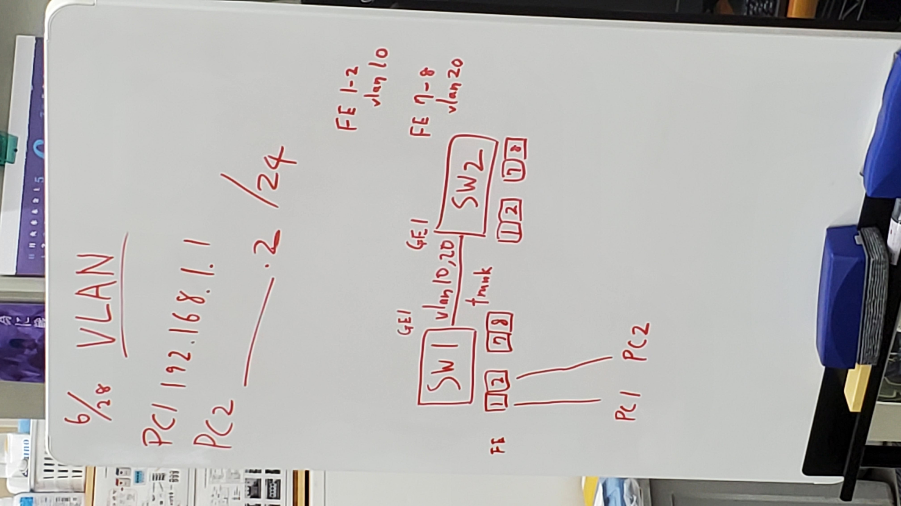

# VLAN
## 概要
- 実験日: 2022/06/28
- CCNA第8章相当 Catalystスイッチの基本設定とVLAN
## 実験環境

- Swtich1・2をtrunkモードでVLan10・20で接続
ポートは互いにGE1
- FE1・2→VLan10
- FE7・8→VLan20
- PC1→192.168.1.1
- PC2→192.1168.1.2

# 実験1

Switch1のFE1・2にPC1・2をそれぞれ接続

pingは通るか？

### 仮説

VLanが同じなので通る

### 結果

通った

念の為FE7・8に接続したが、これも通った

# 実験2

Swtich1のFE1にPC1、FE8にPC2を接続

### 仮説

VLanが異なるため通らない

### 結果

通らない

# 実験3

SW1のFE1にPC1、SW2のFE7にPC2を接続

### 仮説

VLanが異なるため通らない

### 結果

通らない

# 実験4

SW1のFE1にPC1、SW2のFE2にPC2を接続

### 仮説

VLanが同じなので通る

### 結果

通った

# 実験5

SW同士はtrunkモードで接続されている

SW間のパケットはどうなっているか？

### 実験環境

上記の環境でトランクポートをミラーしてwiresharkで見る

### 仮説

IEEE 802.1Qのフレームでは先頭から13バイト目〜17バイト目までがタグ

タグ内の最後尾12ビットにVLan IDがあるはず

### 結果

最初はタグがwireshark内で表示されなかった

→IntelのNICでないとタグを引き剥がしてしまうみたい

機器がないので断念

# 実験6

VLAN環境を自分たちで構築する

### 結果

コマンドを自分たちで打って環境構築できた

(config)#vlan [] : VLanの作成

(config-if)#switchport mode [] : モードの設定

(config-if)#switchport access [] : VLanの指定

## まとめ

- VLanはネットワークを仮想的に分けることができる
- VLanはスイッチ上で複数のネットワークを作る
- スイッチはMACアドレスとVLAN情報を同時に登録する。VLAN情報が一致した時にのみMACアドレスを検索する
- 同じVLanに属する端末同士は通信できる
- VLanで分けることで部署ごとに通信を分けたりすることができる
- ポートの動作モードにはtrunk, accessなどがある
- trunkモード：トランクポートとして動作する。複数のVLANに属すポートとなる。
- accessモード：アクセスポートとして動作する。1つのVLANに属すポートとなる。
- DTP(Dynamic Trunking Protocol)：
## Packet Tracer

[VLAN.pkt](pkt/VLAN.pkt)