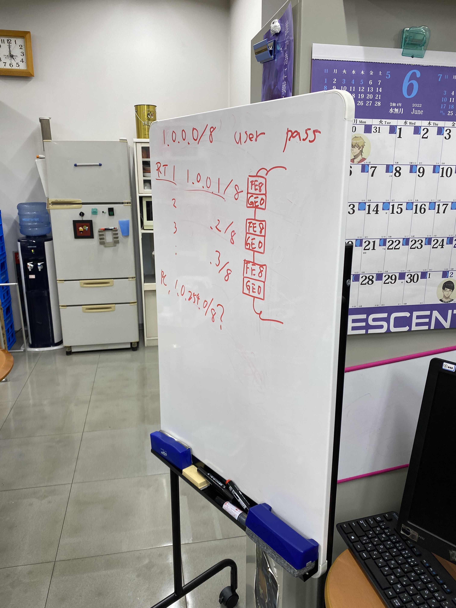
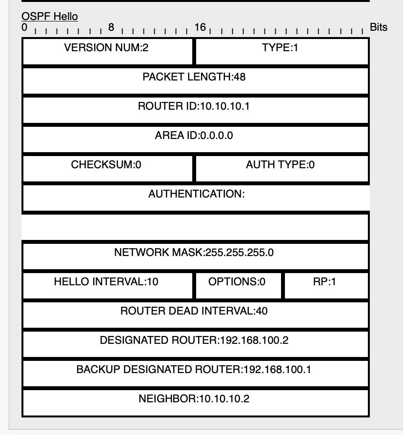

##### 活動実施日：2022年7月11日
# インフラ実験活動レポート（OSPF前半）

### 1　実験環境と構築

1.1 実験環境

実験環境を以下に示す。

 
図１　構築の際に用いた図

* ルーター同士はGE０とFE８で接続させることでそれぞれの通信速度を等しくしている(理由：各経路のコストを等しくするため)
* ルーターIDにはループバックアドレスを用いている(理由：ループバックアドレスはルーターが正常に作動している場合に明示的にShutdownしない限りDownしないからと、仮想的なNICなので物理インターフェースの影響を受けないから)
* プライオリティは全てのルータが１であるため、ルーターI Dの大きさによってDR／BDRの選出が行われる
* OSPFを有効化させるインターフェースの指定に、共通で0.0.0.255のワイルドカードマスクを使用した(つまり、残り８ビットが任意になるIPアドレスを指定したということ)
* 各経路のコストは等しい(コスト=10^8/帯域幅)
* 全てのルーターは同じエリアに属している
* ルーターにはSSH接続で設定を行った
* 各ルータのそれぞれのインターフェースに設定したアドレスを以下に示す

RT1: 
LO 10.10.10.1 
FE8 172.16.10.1 
GE0 192.168.100.1 

RT2: 
LO 10.10.10.2 
FE8 192.168.100.2 
GE0 192.168.150.1 

RT3: 
LO 10.10.10.3 
FE8 192.168.150.2 
GE0 172.168.30.1 

1.2　構築方法

　簡易的な構築手順を以下に示す。 
①	ループバックアドレスを設定する 
②	ルーターの各インターフェースにIPアドレスを設定する 
③	OSPFの設定をする 
④	他のルーターにも①〜③を行う 

注意点： 
* ワイルドカードマスクでは条件に応じて適切に設定する
* プロセスIDは範囲内の値であれば各ルーターで異なる値を設定しても構わない

### 2　実験内容

　行った実験とその結果を以下に示す。

**実験１** 
RT１からRT３へpingが通るのか。また、反対からもpingを打ってみる。

**仮説** 
OSPFの設定が完了しており、ネイバーとして認識されていると考えられるためpingは通る。

**結果** 
通った。よって、各ルーターで適切にネイバーが認識されていると考えられる。
以下はパケットトレーサーで実行した際の結果である。

>Router#ping 172.16.30.1 
>
>Type escape sequence to abort. 
>Sending 5, 100-byte ICMP Echos to 172.16.30.1, timeout is 2 seconds: 
>!!!!! 
>Success rate is 100 percent (5/5), round-trip min/avg/max = 0/0/1 ms 

下図２の通り、パケットの中身を見てみるとHelloパケットが送信されていることも確認できた。

 
図２　Helloパケット

**実験２** 
show ip ospf neighborコマンドで各ルーターのネイバーを確認してみる。

**結果** 
各ルーターが適切にネイバーを認識していた。よって、Helloパケットが正常に送受信されていたことが確認できた。そして、RT１はRT2をDRとして、RT2はRT1をBDR・RT3をDRとして、RT3はRT2をBDRとして認識していた。また、各stateはFULLであったためLSDBの同期が完了しアジャセンシー(完全な隣接関係)になっていることが確認できた。
以下にパケットトレーサーで確認した結果を示す。

>RT1: 
>
>Router#show ip ospf neighbor 
>Neighbor ID Pri State Dead Time Address Interface 
>10.10.10.2 1 FULL/DR 00:00:39 192.168.100.2 GigabitEthernet0/0/0 

>RT2: 
>
>Router#show ip ospf neighbor 
>Neighbor ID Pri State Dead Time Address Interface 
>10.10.10.1 1 FULL/BDR 00:00:30 192.168.100.1 GigabitEthernet0/0/0 
>10.10.10.3 1 FULL/DR 00:00:30 192.168.150.2 GigabitEthernet0/0/1 

>RT3: 
>
>Router#show ip ospf neighbor  
>Neighbor ID Pri State Dead Time Address Interface 
>10.10.10.2 1 FULL/BDR 00:00:31 192.168.150.1 GigabitEthernet0/0/0 

**実験3** 
show ip ospf databaseコマンドでLSDBの要約情報を確認してみる。

**結果** 
LSAを生成したルーターの情報と実際に用意したルーターに矛盾がなかったため、正しく通信できることが確認できた。
以下にパケットトレーサーで確認した結果を示す。

>Router#show ip ospf database 
>OSPF Router with ID (10.10.10.1) (Process ID 10)
>
>Router Link States (Area 0)  ←LSAを生成したルーターの情報
>
>Link ID ADV Router Age Seq# Checksum Link count
>10.10.10.1 10.10.10.1 436 0x80000005 0x007b21 2
>10.10.10.3 10.10.10.3 442 0x80000005 0x002fef 2
>10.10.10.2 10.10.10.2 437 0x80000006 0x005706 2
>
>Net Link States (Area 0)
>Link ID ADV Router Age Seq# Checksum
>192.168.150.2 10.10.10.3 442 0x80000002 0x007422
>192.168.100.2 10.10.10.2 437 0x80000002 0x009239

**実験4** 
show ip routeコマンドで、ルーティングテーブルから各ルーターがOSPFでルートを学習できているか確認してみる。

**結果** 
今回の構成では、OSPFによって学習するルートは2つであるがルーティングテーブルを確認した結果、適切なルートを学習できていることが確認できた。
以下にパケットトレーサーで確認した結果を示す。

>RT1: 
>O 172.16.30.0/24 [110/3] via 192.168.100.2, 00:39:39, GigabitEthernet0/0/0 
>O 192.168.150.0/24 [110/2] via 192.168.100.2, 00:39:39, GigabitEthernet0/0/0 

>RT2: 
>O 172.16.10.0/24 [110/2] via 192.168.100.1, 00:40:58, GigabitEthernet0/0/0 
>O 172.16.30.0/24 [110/2] via 192.168.150.2, 00:41:08, GigabitEthernet0/0/1 

>RT3: 
>O 172.16.10.0/24 [110/3] via 192.168.150.1, 00:43:16, GigabitEthernet0/0/0 
>O 192.168.100.0/24 [110/2] via 192.168.150.1, 00:43:16, GigabitEthernet0/0/0 

**実験５** 
show ip protocolsコマンドでOSPFのプロトコル情報を確認してみる。

**結果** 
各ルーターで設定したルーターID、networkコマンドで設定した内容、LSAを送り出しているルーターなどを確認することができた。また、自分達で設定した内容と矛盾が生じていなかった。
以下にパケットトレーサーで確認した結果を示す。

>RT1: 
>Router#show ip protocols  
>
>Routing Protocol is "ospf 10" 
>Outgoing update filter list for all interfaces is not set  
>Incoming update filter list for all interfaces is not set  
>Router ID 10.10.10.1 
>Number of areas in this router is 1. 1 normal 0 stub 0 nssa 
>Maximum path: 4 
>Routing for Networks: 
>192.168.100.0 0.0.0.255 area 0 
>172.16.10.0 0.0.0.255 area 0 
>Routing Information Sources:  
>Gateway Distance Last Update  
>10.10.10.1 110 00:15:30 
>10.10.10.2 110 00:15:31 
>10.10.10.3 110 00:15:36 
>Distance: (default is 110) 

>RT2: 
>Router#show ip protocols  
>
>Routing Protocol is "ospf 10" 
>Outgoing update filter list for all interfaces is not set  
>Incoming update filter list for all interfaces is not set  
>Router ID 10.10.10.2 
>Number of areas in this router is 1. 1 normal 0 stub 0 nssa 
>Maximum path: 4 
>Routing for Networks: 
>192.168.100.0 0.0.0.255 area 0 
>192.168.150.0 0.0.0.255 area 0 
>Routing Information Sources:  
>Gateway Distance Last Update  
>10.10.10.1 110 00:15:02 
>10.10.10.2 110 00:15:02 
>10.10.10.3 110 00:15:08 
>Distance: (default is 110) 

>RT3: 
>Router#show ip protocols  
>
>Routing Protocol is "ospf 10" 
>Outgoing update filter list for all interfaces is not set  
>Incoming update filter list for all interfaces is not set  
>Router ID 10.10.10.3 
>Number of areas in this router is 1. 1 normal 0 stub 0 nssa 
>Maximum path: 4 
>Routing for Networks: 
>192.168.150.0 0.0.0.255 area 0 
>172.16.30.0 0.0.0.255 area 0 
>Routing Information Sources:  
>Gateway Distance Last Update  
>10.10.10.1 110 00:13:58 
>10.10.10.2 110 00:13:58 
>10.10.10.3 110 00:14:03 
>Distance: (default is 110) 

**実験６** 
show ip ospf interfaceコマンドでOSPFが動作しているインターフェース情報を確認してみる。

**結果** 
各ルーターのインターフェースごとに振られたIPアドレスや所属するエリア、プロセスIDとルーターID、ネットワークタイプ、コスト、リンクの状態とプライオリティ、DRとBDRのルーターIDとIPアドレス、HelloインターバルとDeadインターバルを確認することができた。また、各ルーター間でこの設定にずれが生じていないことも確認できた。
以下にパケットトレーサーで確認した結果を示す。

>RT1: 
>Router#show ip ospf interface  
>
>GigabitEthernet0/0/1 is up, line protocol is up 
>Internet address is 172.16.10.1/24, Area 0 
>Process ID 10, Router ID 10.10.10.1, Network Type BROADCAST, Cost: 1 
>Transmit Delay is 1 sec, State DR, Priority 1 
>Designated Router (ID) 10.10.10.1, Interface address 172.16.10.1 
>No backup designated router on this network 
>Timer intervals configured, Hello 10, Dead 40, Wait 40, Retransmit 5 
>Hello due in 00:00:09 
>Index 1/1, flood queue length 0 
>Next 0x0(0)/0x0(0) 
>Last flood scan length is 1, maximum is 1 
>Last flood scan time is 0 msec, maximum is 0 msec 
>Neighbor Count is 0, Adjacent neighbor count is 0 
>Suppress hello for 0 neighbor(s) 
>GigabitEthernet0/0/0 is up, line protocol is up 
>Internet address is 192.168.100.1/24, Area 0 
>Process ID 10, Router ID 10.10.10.1, Network Type BROADCAST, Cost: 1 
>Transmit Delay is 1 sec, State BDR, Priority 1 
>Designated Router (ID) 10.10.10.2, Interface address 192.168.100.2 
>Backup Designated Router (ID) 10.10.10.1, Interface address 192.168.100.1 
>Timer intervals configured, Hello 10, Dead 40, Wait 40, Retransmit 5 
>Hello due in 00:00:09 
>Index 2/2, flood queue length 0 
>Next 0x0(0)/0x0(0) 
>Last flood scan length is 1, maximum is 1 
>Last flood scan time is 0 msec, maximum is 0 msec 
>Neighbor Count is 1, Adjacent neighbor count is 1 
>Adjacent with neighbor 10.10.10.2 (Designated Router) 
>Suppress hello for 0 neighbor(s) 

>RT2: 
>Router#show ip ospf interface  
>
>GigabitEthernet0/0/0 is up, line protocol is up 
>Internet address is 192.168.100.2/24, Area 0 
>Process ID 10, Router ID 10.10.10.2, Network Type BROADCAST, Cost: 1 
>Transmit Delay is 1 sec, State DR, Priority 1 
>Designated Router (ID) 10.10.10.2, Interface address 192.168.100.2 
>Backup Designated Router (ID) 10.10.10.1, Interface address 192.168.100.1 
>Timer intervals configured, Hello 10, Dead 40, Wait 40, Retransmit 5 
>Hello due in 00:00:09 
>Index 1/1, flood queue length 0 
>Next 0x0(0)/0x0(0) 
>Last flood scan length is 1, maximum is 1 
>Last flood scan time is 0 msec, maximum is 0 msec 
>Neighbor Count is 1, Adjacent neighbor count is 1 
>Adjacent with neighbor 10.10.10.1 (Backup Designated Router) 
>Suppress hello for 0 neighbor(s) 
>GigabitEthernet0/0/1 is up, line protocol is up 
>Internet address is 192.168.150.1/24, Area 0 
>Process ID 10, Router ID 10.10.10.2, Network Type BROADCAST, Cost: 1 
>Transmit Delay is 1 sec, State BDR, Priority 1 
>Designated Router (ID) 10.10.10.3, Interface address 192.168.150.2 
>Backup Designated Router (ID) 10.10.10.2, Interface address 192.168.150.1 
>Timer intervals configured, Hello 10, Dead 40, Wait 40, Retransmit 5 
>Hello due in 00:00:09 
>Index 2/2, flood queue length 0 
>Next 0x0(0)/0x0(0) 
>Last flood scan length is 1, maximum is 1 
>Last flood scan time is 0 msec, maximum is 0 msec 
>Neighbor Count is 1, Adjacent neighbor count is 1 
>Adjacent with neighbor 10.10.10.3 (Designated Router) 
>Suppress hello for 0 neighbor(s) 

>RT3: 
>Router#show ip ospf interface  
>
>GigabitEthernet0/0/1 is up, line protocol is up 
>Internet address is 172.16.30.1/24, Area 0 
>Process ID 10, Router ID 10.10.10.3, Network Type BROADCAST, Cost: 1 
>Transmit Delay is 1 sec, State DR, Priority 1 
>Designated Router (ID) 10.10.10.3, Interface address 172.16.30.1 
>No backup designated router on this network 
>Timer intervals configured, Hello 10, Dead 40, Wait 40, Retransmit 5 
>Hello due in 00:00:00 
>Index 1/1, flood queue length 0 
>Next 0x0(0)/0x0(0) 
>Last flood scan length is 1, maximum is 1 
>Last flood scan time is 0 msec, maximum is 0 msec 
>Neighbor Count is 0, Adjacent neighbor count is 0 
>Suppress hello for 0 neighbor(s) 
>GigabitEthernet0/0/0 is up, line protocol is up 
>Internet address is 192.168.150.2/24, Area 0 
>Process ID 10, Router ID 10.10.10.3, Network Type BROADCAST, Cost: 1 
>Transmit Delay is 1 sec, State DR, Priority 1 
>Designated Router (ID) 10.10.10.3, Interface address 192.168.150.2 
>Backup Designated Router (ID) 10.10.10.2, Interface address 192.168.150.1 
>Timer intervals configured, Hello 10, Dead 40, Wait 40, Retransmit 5 
>Hello due in 00:00:00 
>Index 2/2, flood queue length 0 
>Next 0x0(0)/0x0(0) 
>Last flood scan length is 1, maximum is 1 
>Last flood scan time is 0 msec, maximum is 0 msec 
>Neighbor Count is 1, Adjacent neighbor count is 1 
>Adjacent with neighbor 10.10.10.2 (Backup Designated Router) 
>Suppress hello for 0 neighbor(s) 

### 3　まとめ

　今回の実験を通して知り得た主なことを箇条書きで以下に示す。 
* ルーターIDを設定する際は、ループバックアドレスを用いるのが良い
* ルーターIDの決定優先順位はコマンドで設定したアドレス、ループバックアドレス、物理インターフェースアドレスの順である
* コストは10^8/帯域幅で求めることができ、コストを変更するためには以下の3つの方法がある  
⑴	手動で設定する 
⑵	帯域幅を変更する 
⑶	分子を変更する 
* コストの算出式はネットワークで統一しなければならない
* DR /BDRはプライオリティの大きさ、ルーターIDの大きさの順で決定される
* Helloパケットを交換してネイバーを検出する
* マルチキャストでHelloパケットを投げるときは224.0.0.5で全てのルーターに届き、DRなどだけに届けたいときは224.0.0.6で送信する
* ネイバーはshow ip ospf neighborコマンドで確認することができる
* LSDBの要約情報はshow ip ospf databaseコマンドで確認できる
* OSPFのプロトコル情報はshow ip protcolsコマンドで確認できる
* うまく接続できない際はshow ip ospf interfaceコマンドでルーター間の設定にずれが生じていないかを確認してみる