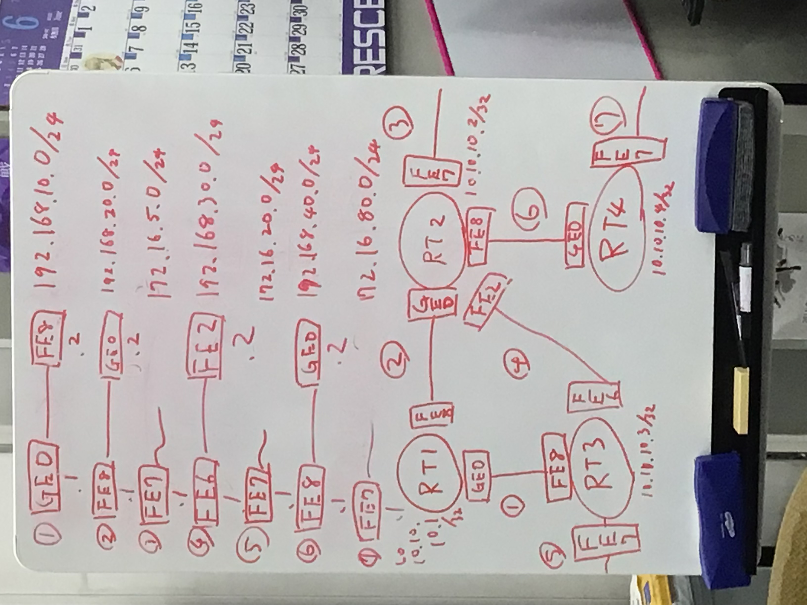
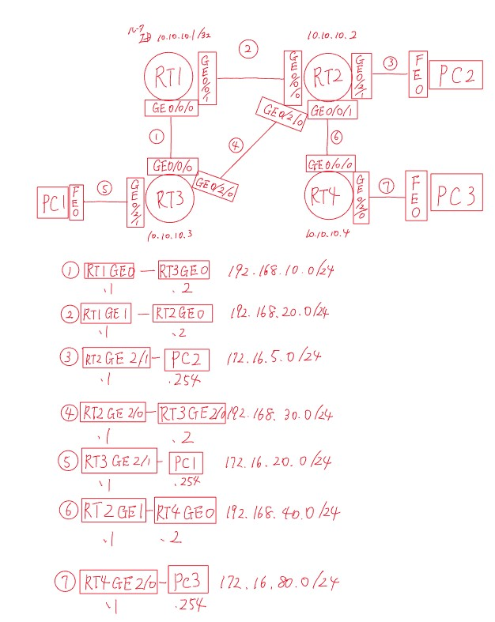

# OSPF実験後半 シングルエリア

# 概要
* 実験日: 2022/07/27 
* CCNA第4章相当 OSPF シングルエリア編
  
## 1 実験環境

#### 図1:実際に構築の際に用いた図
図１をCiscoパケットトレーサーで再現し以下に示す。

#### 図2,Ciscoのパケットトレーサーで再現したospfの設計画像
* ルーターIDは、10.10.10.1~4 255.255.255.255
* OSPFは、エリア 0に設定
* RT2及び3のGE0/2/0及びGE0/2/1はそれぞれVlan100・110で接続
* RT4のGE0/2/0はVlan100で接続
* 図2では、新たにPC1(192.168.20.254)、PC2(172.16.5.254)、PC3(172.16.80.254)を作成する
---
## 2 実験内容
* 実験1 
        
RT2にて、show ip ospf neighborコマンドを実行すると、どのルータがDR、BDR、DROtherになるのか。

  * 仮説 
    
同じプライオリティ値よりルーターIDが大きい10.10.10.3~4の値を持つRT3,4がDRとなり、ルーターIDが小さいRT1はBDRになる。

  * 結果
    <dl>
    <dt> RT2 </dt>
    <dt> show ip ospf neighbor </dt>
    <dd> 
      Neighbor ID     Pri   State           Dead Time   Address         Interface  
      10.10.10.3        1   FULL/DR         00:00:39    192.168.30.2    Vlan100 
      10.10.10.1        1   FULL/BDR        00:00:33    192.168.20.1    GigabitEthernet0/0/0 
      10.10.10.4        1   FULL/DR         00:00:33    192.168.40.2    GigabitEthernet0/0/1
    </dd> 
    <dd>以上の結果より、RT3,4はDR、RT1はBDRと表示されている事から、仮説通り、同じプライオリティ値なら隣のルーターIDが小さければBDRとなり、値が大きければDRとなることが分かる。</dd>
    </dl>
    
---
* 実験2  
        
お互いのルータが認識出来ているか確認するために、show ip ospf neighborで確認する。

  * 結果
    <dl>
    <dt> RT1 </dt>
    <dt> show ip ospf neighbor </dt>
    <dd>
    Neighbor ID     Pri   State           Dead Time   Address         Interface 
    10.10.10.3        1   FULL/DR         00:00:34    192.168.10.2    GigabitEthernet0/0/0 
    10.10.10.2        1   FULL/DR         00:00:33    192.168.20.2    GigabitEthernet0/0/1 
    </dd>
    <dt> RT2 </dt>
    <dt> show ip ospf neighbor </dt>
    <dd>
    Neighbor ID     Pri   State           Dead Time   Address         Interface 
    10.10.10.3        1   FULL/DR         00:00:39    192.168.30.2    Vlan100 
    10.10.10.1        1   FULL/BDR        00:00:33    192.168.20.1    GigabitEthernet0/0/0 
    10.10.10.4        1   FULL/DR         00:00:33    192.168.40.2    GigabitEthernet0/0/1 
    </dd>
    <dt> RT3 </dt>
    <dt> show ip ospf neighbor </dt>
    <dd>
    Neighbor ID     Pri   State           Dead Time   Address         Interface  
    10.10.10.2        1   FULL/BDR        00:00:37    192.168.30.1    Vlan100 
    10.10.10.1        1   FULL/BDR        00:00:37    192.168.10.1    GigabitEthernet0/0/0 
    <dt> RT4 </dt>
    <dt> show ip ospf neighbor </dt>
    <dd>
    Neighbor ID     Pri   State           Dead Time   Address         Interface  
    10.10.10.2        1   FULL/BDR        00:00:39    192.168.40.1    GigabitEthernet0/0/0 
    </dd>
    </dl>
---
* 実験3 
        
PC1からPC3へtracertコマンドを入力すると、どのような経路で接続されるのか。

  * 仮説 
    
実験3より、お互いにルータを認識しているためtracertは通る。
    また、図2より最もコストが少ないPC1→⑤→RT3→④→RT2→⑥→RT4→⑦→PC3のような経路で接続されているはずである。

  * 結果 
    <dl>
    <dt> PC1 </dt>
    <dt> tracert 172.16.80.254 </dt>
    <dd>
    Tracing route to 172.16.80.254 over a maximum of 30 hops:  
    1   0 ms      0 ms      0 ms      172.16.20.1  
    2   0 ms      0 ms      0 ms      192.168.30.1  
    3   0 ms      0 ms      0 ms      192.168.40.2  
    4   *        　 0 ms      0 ms      172.16.80.254  
    Trace complete.
    </dd> 
    <dd>
    以上の結果より、PC1→⑤→RT3→④→RT2→⑥→RT4→⑦→PC3のような経路で接続されていることが分かる。
    </dd>
    </dl>
---
* 実験4  
        
④が何らかの理由によって、切断されてしまったとき、PC1からPC3へtracertコマンドを入力すると、どのような経路で接続されているのか

  * 仮説
    
④の経路が使用不可能であるため、PC1→⑤→RT3→①→RT1→②→RT2→⑥→RT4→⑦→PC3のような経路で接続されているはずである。

  * 結果
    <dl>
    <dt> PC1 </dt>
    <dt> tracert 172.16.80.254 </dt>
    <dd>
    Tracing route to 172.16.80.254 over a maximum of 30 hops:  
    1   0 ms      0 ms      0 ms      172.16.20.1 
    2   0 ms      0 ms      5 ms      192.168.10.1 
    3   0 ms      0 ms      0 ms      192.168.20.2 
    4   0 ms      0 ms      0 ms      192.168.40.2 
    5   0 ms      0 ms      0 ms      172.16.80.254 
    Trace complete.
    </dd> 
    <dd>
    以上の結果より、PC1→⑤→RT3→①→RT1→②→RT2→⑥→RT4→⑦→PC3のような経路で接続されていることが分かる。
    </dd>
    
    </dl>
---
* 実験5 
        
RT2にて、show ip ospf databaseコマンドを実行すると、どのように表示されるのか

  * 結果 
    <dl>
    <dt> RT2 </dt>
    <dt> show ip ospf database </dt>
    <dd>
    OSPF Router with ID (10.10.10.2) (Process ID 10) 
    Router Link States (Area 0)  
    Link ID         ADV Router      Age         Seq#       Checksum Link count 
    10.10.10.2      10.10.10.2      1140        0x8000001b 0x00f0df 4 
    10.10.10.3      10.10.10.3      1140        0x8000001a 0x001eeb 3 
    10.10.10.4      10.10.10.4      466         0x8000000b 0x00fec2 2 
    10.10.10.1      10.10.10.1      460         0x8000000b 0x0027ed 2 
     
    Net Link States (Area 0) 
    Link ID         ADV Router      Age         Seq#       Checksum 
    192.168.20.2    10.10.10.2      465         0x80000007 0x00090d 
    192.168.30.2    10.10.10.3      1140        0x8000000d 0x009d3a 
    192.168.40.2    10.10.10.4      466         0x80000007 0x009560 
    192.168.10.2    10.10.10.3      460         0x8000000e 0x00db9c 

    </dd>
    </dl>
    
---
* 実験6 
        
RT2にてshow ip routeコマンドを実行すると、どのように表示されるのか。

  * 結果 
    <dl>
    <dt> RT2 </dt>
    <dt> show ip route </dt>
    <dd>
    10.0.0.0/32 is subnetted, 1 subnets
     C 10.10.10.2/32 is directly connected, Loopback0
     172.16.0.0/16 is variably subnetted, 4 subnets, 2 masks
     C 172.16.5.0/24 is directly connected, Vlan110
     L 172.16.5.1/32 is directly connected, Vlan110
     O 172.16.20.0/24 [110/2] via 192.168.30.2, 00:01:28, Vlan100
     O 172.16.80.0/24 [110/2] via 192.168.40.2, 00:01:28, GigabitEthernet0/0/1
     O 192.168.10.0/24 [110/2] via 192.168.30.2, 00:01:28, Vlan100
    [110/2] via 192.168.20.1, 00:01:28, GigabitEthernet0/0/0
     192.168.20.0/24 is variably subnetted, 2 subnets, 2 masks
     C 192.168.20.0/24 is directly connected, GigabitEthernet0/0/0
     L 192.168.20.2/32 is directly connected, GigabitEthernet0/0/0
    192.168.30.0/24 is variably subnetted, 2 subnets, 2 masks
     C 192.168.30.0/24 is directly connected, Vlan100
     L 192.168.30.1/32 is directly connected, Vlan100
     192.168.40.0/24 is variably subnetted, 2 subnets, 2 masks
     C 192.168.40.0/24 is directly connected, GigabitEthernet0/0/1
     L 192.168.40.1/32 is directly connected, GigabitEthernet0/0/1
    </dd>
    </dl>
---
## 3 まとめ

* RIPと比較してOSPFを使用するメリット
  * OSPFはHelloパケットによって隣接間のルータの情報を更新し合い、差分アップデートされるため、RIPより更新が早い。
  * RIPは30s間隔で、全ての経路情報を交換するため、ネットワーク全体の経路を更新する際するのに、大規模なネットワークは向いていないが、OSPFは変更した情報のみを更新するため向いている。
* ルータIDは重複してはいけない
* ルータIDを決定する際の優先順位
  1. ルータIDのコマンドでの手動設定
  2. ループバックアドレスに設定した最も大きいIPアドレス
  3. 有効な物理インターフェースアドレスに設定した最も大きいIPアドレス
  * 基本的には2.ループバックアドレスに設定した最も大きいIPアドレスが望ましい
* コストを変更する手法
    * 手動で設定
    * 帯域を変更
    * 分子を変更
* DR、BDRの選出順位
  1. プライオリティ値
  2. ルータID  
* ルータプライオリティは、代表ルータを決めるものであり、経路を決めるものじゃない