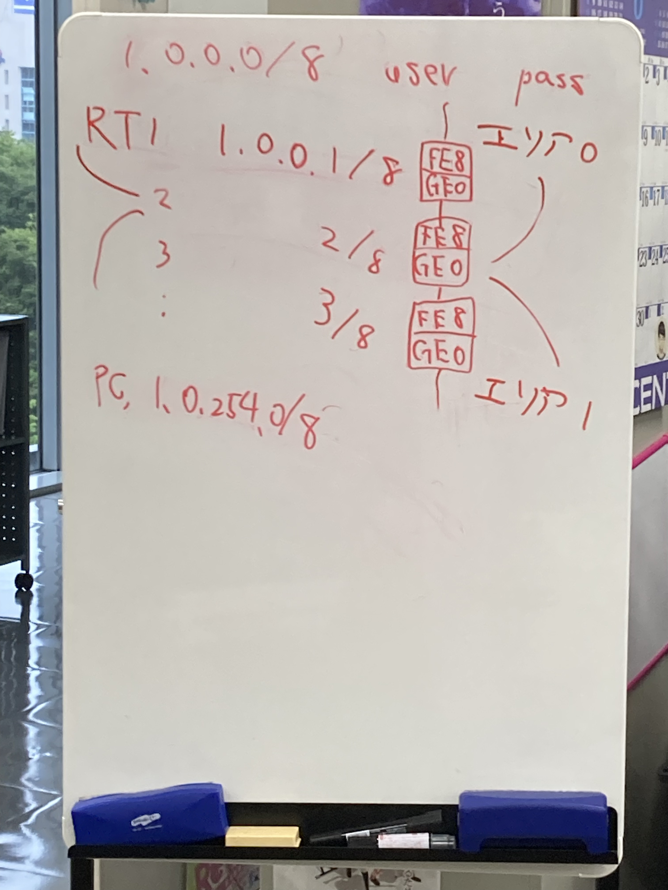
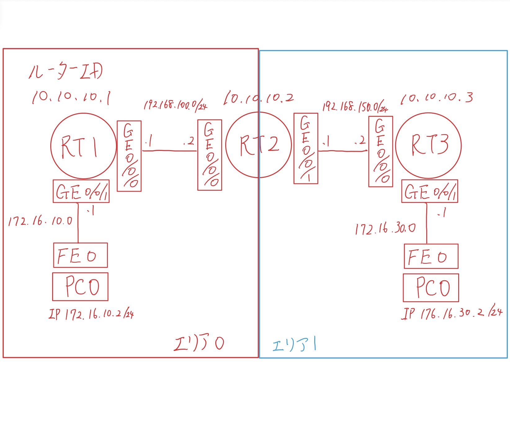
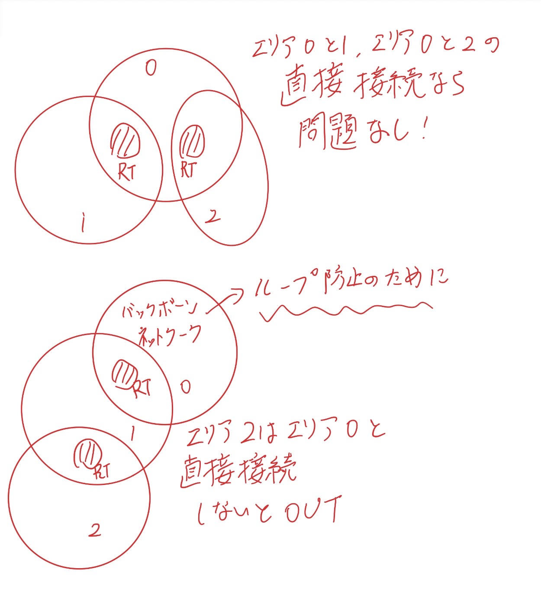

# OSPF実験後半 マルチエリア

# 概要
* 実験日: 2022/07/27 
* CCNA第4章相当 OSPF マルチエリア編

## 1 実験環境

#### 図1:実際に構築の際に用いた図
図１をCiscoパケットトレーサーで再現し以下に示す。

#### 図2,Ciscoのパケットトレーサーで再現したospfの設計画像

---
## 2 実験内容

* 実験1 
        
show ip ospf neighborコマンドを実行すると、どのルータがDR、BDR、DROTHERになるのか。

  * 結果
    <dl>
    <dt> RT1 </dt>
    <dt> show ip ospf neighbor </dt>
    <dd> 
    Neighbor ID     Pri   State           Dead Time   Address         Interface  
    10.10.10.2        1   FULL/DR         00:00:31    192.168.100.2   GigabitEthernet0/0/0  
    </dd> 
    <dt> RT2 </dt>
    <dt> show ip ospf neighbor </dt>
    <dd> 
    Neighbor ID     Pri   State           Dead Time   Address         Interface  
    10.10.10.1        1   FULL/BDR        00:00:31    192.168.100.1   GigabitEthernet0/0/0  
    10.10.10.3        1   FULL/DR         00:00:31    192.168.150.2   GigabitEthernet0/0/1  
    </dd> 
    <dt> RT3 </dt>
    <dt> show ip ospf neighbor </dt>
    <dd> 
    Neighbor ID     Pri   State           Dead Time   Address         Interface  
    10.10.10.2        1   FULL/BDR        00:00:32    192.168.150.1   GigabitEthernet0/0/0  
    </dd> 
    <dd>以上の結果より、RT2は同じプライオリティ値だった場合、ルータIDが大きい値をDRにして、低い値をBDRにすることが分かる。</dd>
    </dl>
---
* 実験2 
        
show ip rouute コマンドを実行すると、どのように表示されるのか。

  * 結果 
    <dl>
    <dt> RT1</dt>
    <dt> show ip rouute </dt>
    <dd>
    Gateway of last resort is not set 
          10.0.0.0/32 is subnetted, 1 subnets 
    C        10.10.10.1/32 is directly connected, Loopback0 
        172.16.0.0/16 is variably subnetted, 3 subnets, 2 masks 
    C       　172.16.10.0/24 is directly connected, GigabitEthernet0/0/1 
    L       　172.16.10.1/32 is directly connected, GigabitEthernet0/0/1 
    O IA    　172.16.30.0/24 [110/3] via 192.168.100.2, 00:19:57,GigabitEthernet0/0/0 
     192.168.100.0/24 is variably subnetted, 2 subnets, 2 masks 
    C       　192.168.100.0/24 is directly connected, GigabitEthernet0/0/0 
    L       　192.168.100.1/32 is directly connected, GigabitEthernet0/0/0 
    O IA 　192.168.150.0/24 [110/2] via 192.168.100.2, 00:20:07,GigabitEthernet0/0/0 
    </dd> 

    <dl>
    <dt> RT2</dt>
    <dt> show ip rouute </dt>
    <dd>
    Gateway of last resort is not set
        10.0.0.0/32 is subnetted, 1 subnets 
    C       　10.10.10.1/32 is directly connected, Loopback0 
        172.16.0.0/16 is variably subnetted, 3 subnets, 2 masks 
    C       　172.16.10.0/24 is directly connected, GigabitEthernet0/0/1 
    L        172.16.10.1/32 is directly connected, GigabitEthernet0/0/1 
    O IA    　172.16.30.0/24 [110/3] via 192.168.100.2, 00:19:57, GigabitEthernet0/0/0 
        192.168.100.0/24 is variably subnetted, 2 subnets, 2 masks
    C       　192.168.100.0/24 is directly connected, GigabitEthernet0/0/0 
    L       　192.168.100.1/32 is directly connected, GigabitEthernet0/0/0 
    O IA 　192.168.150.0/24 [110/2] via 192.168.100.2, 00:20:07, GigabitEthernet0/0/0 
    </dd> 

    <dl>
    <dt> RT3</dt>
    <dt> show ip rouute </dt>
    <dd>
    Gateway of last resort is not set 
        10.0.0.0/32 is subnetted, 1 subnets 
    C       　10.10.10.3/32 is directly connected, Loopback0 
        172.16.0.0/16 is variably subnetted, 3 subnets, 2 masks 
    O IA    　172.16.10.0/24 [110/3] via 192.168.150.1, 00:22:06,GigabitEthernet0/0/0 
    C       　172.16.30.0/24 is directly connected, GigabitEthernet0/0/1 
    L       　172.16.30.1/32 is directly connected, GigabitEthernet0/0/1 
    O IA    　192.168.100.0/24 [110/2] via 192.168.150.1, 00:22:06, GigabitEthernet0/0/0 
        192.168.150.0/24 is variably subnetted, 2 subnets, 2 masks 
    C       　192.168.150.0/24 is directly connected, GigabitEthernet0/0/0 
    L       　192.168.150.2/32 is directly connected, GigabitEthernet0/0/0 
    </dd> 

    <dd>
    RT1の「O IA」を見るとRT3の「172.16.30.0/24、192.168.150.0/24」情報を伝えられている事から、異なるエリアでもルート情報を得られていることが分かる。
    </dd>
    </dl>
---
## 3 まとめ

* 実験1
  * 同じプライオリティ値の際には、ルータIDを参照し、自分のルータより大きい値をDR、小さい値をBDRもしくはDROTHERとして選出している。
* 実験2
  * エリア内では「O」として表示され、エリア外では「O IA」を見ることで区別されている。
  * 異なるエリアでもルート情報を得られる。
* エリアを作成する際の注意点
    
    * バックボーンエリアを作る
      * ループを防止するため 
    * 基本的にエリア0のバックボーンエリアに接するように作る必要がある点。(バーチャルリンクを利用すれば例外的にバックボーンエリアを経由しなくても問題なし)
    * エリア同士が重なる場所にはルータを設置する必要がある。
