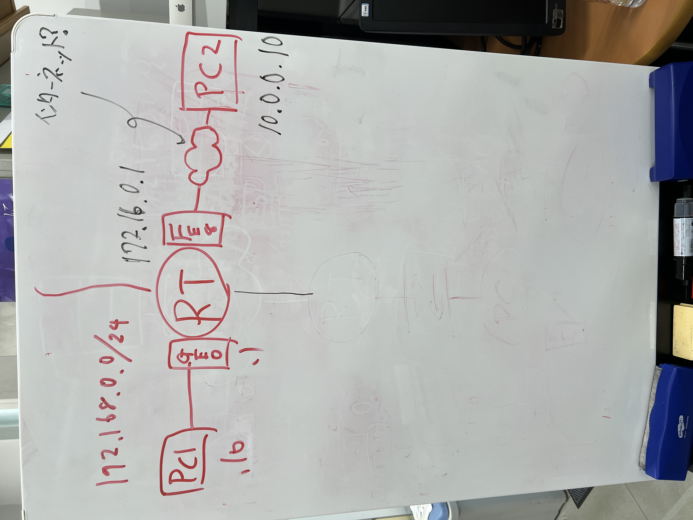

# タイトル
## 概要
- 実験日: 2022/08/09
- CCNA第6章相当 NAT/DHCP/DNS(実験は割愛)
 

## 1　実験環境(スタティックNAT)

- クライアント側ネットワークアドレス192.168.0.0/24から、PC１は192.168.0.10を内部ローカルアドレスとして設定
- RTのGE0には192.168.0.1及びFE8に172.16.0.1をそれぞれインターフェイスに設定
- 宛先サーバの代わりにPC2を用意し、IPアドレス10.0.0.10を設定
- RTには内部ローカルアドレス192.168.0.10を静的に172.16.0.2変換させるよう設定

## 1　実験内容

* 実験1-1 
    
RTにNATテーブルができているのかを確認する（#show ip nat translation）

    仮説：登録したInside global及びInside localにIPアドレスが設定されている 

    ### 結果：仮説通りにInside globalに1172.16.0.2が、Inside localには192.168.0.10が登録がされていた。

* 実験1-2 
    
PC1からPC2に対してPINGが通るかどうか確認する

    仮説：NATテーブルによってアドレス変換されるため、PC2へのPINGは通る 

    ### 結果：PINGが帰ってきたことを確認できた。 また、
    #show ip statistics　でPINGを送った際にアドレス変換されたHit数、Miss数
    #debug ip nat　でPINGを送った際にリアルタイムでアドレス変換の様子（sがソース、dは宛先） 
    を確認した。

* 実験1-3 
    
PC2からローカルに向けてどこまでPINGが通るのか確認する

    仮説：FE8まではPINGが通る。 

    ### 結果：仮説通り、FE8までPINGが通った 
    それよりもローカル寄りのIPアドレスには登録されたNATテーブルがないためパケットが破棄された。
    

      

## 2 実験環境(ダイナミックNAT)

- クライアント側ネットワークアドレス192.168.0.0/24から、PC１は192.168.0.10を内部ローカルアドレスとして設定
- RTのGE0には192.168.0.1及びFE8に172.16.0.1をそれぞれインターフェイスに設定
- 宛先サーバの代わりにPC2を用意し、IPアドレス10.0.0.10を設定
- PC3を用意し、RTのローカルネットワーク側に接続し、192.168.0.20/24を設定
- RTであらかじめ172.16.0.129/24 から 172.16.0.131/24 の三つのアドレスをアドレスプールとして設定
- あらかじめ変換対象となるアドレス帯、ここでは192.168.0.0/24を番号付き標準ACLのpermitに登録。さらにこのACLとアドレスプールを紐付けるよう設定

## 2　実験内容

* 実験2-1 
    
PCから通信がされた際にRTにNATテーブルができているのかを確認する（#show ip nat translation）

    仮説：ダイナミックNATなので、NATプールから払い出されたIPアドレスのどれかがinside globalに、Inside localにはPC1もしくはPC2のIPアドレスが設定されている。 

    ### 結果：仮説通り、登録がされていた。 
    Inside globalに172.16.0.129　Inside localに192.168.0.10  
    Inside globalに172.16.0.130　Inside localに192.168.0.20  
    がそれぞれ#show ip translationで確認できた。

    なお、PC1からPC2に通信時wiresharkにてsorceアドレスがアドレスプールから払い出されたIPを利用して通信していることが確認できた。

* 実験2-2 
    
アドレスプールの使用率をPC接続台数の変化とともに調べる（#show ip nat statistics）

    仮説：現在設定しているアドレスプールからは３つのIPアドレスが割り振れるため、2代接続時には66%ほどの使用率、１台増やせば100%になる。 

    ### 結果：仮説通り、66%になっていた。 
    上記コマンドを打つとallocated 2 (66%)との表示がされた。また、小津くんPC(PC4)を192.168.0.30として接続すると残りのアドレスが払い出され、allocated 3(100%)が確認できた。

     

## NATまとめ
- スタティックNATは機器をグローバルIPと1対1での対応付けをあらかじめ全て設定する必要がる。
- ダイナミックNATはアドレスプールの設定とACLを設定し紐付けする必要がるが動的に空いているものを払い出しする。
- アドレスプールに余裕がないと100%になった際に、アドレスを変換できなかった他の機器がインターネット側への通信ができなくなってしまうので注意が必要である。
- NATの仕組みによって内部のIPが漏れることなくセキュリティに強くなっている

   

## 3 実験環境(DHCPサーバ)

- クライアント側ネットワークアドレスは192.168.0.0/24
- PC１及びPC2はDHCPによってIP自動取得するようにwindowsのネットワークアダプタ設定を書き換える。
- RTのGE0には192.168.0.1をインターフェイスに設定
- D-GWにはRTのローカル側インターフェイスに設定したものと同じく192.168.0.1を設定
- configから、#ip dhcp pool [名前]に入って払い出すネットワーク192.168.0.0/24を設定

- 上記設定の際に、除外アドレスとしてRTのインターフェイスに設定したアドレスと、DNS（今回は仮で192.168.0.5）を設定する ⇨理由：同IPが払い出しされ衝突することを防ぐため

## 3　実験内容

* 実験3-1 
    
PC1及びPC2に加え、小津くんのPC3の3台をRTに繋げた際にDHCP poolの払い出し状況を確認する(#show ip dhcp pool)

    仮説：PCをRTに繋げると自動でIPアドレスが割り当てられ、3台分払い出される。 

    ### 結果：仮説通り、正常に払い出された 
    DHCP pool内のleased addressesが繋げてしばらく経つと加算された。3台繋げたため3と表示がされた

* 実験3-2 
    
PC1、PC2、小津くんのPC3をRTに繋げた際にPCに割り振られたIPと、RTの情報が一致するか確認する(#show ip dhcp binding)

    仮説：PCに割り当てられたIPとRTの上記コマンドで示されたアドレスが一致する。 

    ### 結果：仮説通り、IPアドレスが一致していた 
    PC cmdのipconfigにて表記されたIPv4アドレスと、RTの上記コマンドのautomaticに払い出されたIPアドレスが一致した。

* 実験3-3 
    
PC1、PC2及びPC3をRTに繋げた際にwiresharkを使ってDHCP割り当ての流れを確認する

    仮説：PCをRTに接続するとDHCP DISCOVERがブロードキャストで発信されOFFER REQUEST ACKの順に飛ぶ。 

    ### 結果：仮説通りの順で確認ができた
     
    流れは同じだったが、DHCPが発見できるまでDHCP DISCOVERは複数回出されていることが確認できた。見つかるとOFFER REQUEST ACKが順に進むことが確認できた。 

## DHCPサーバまとめ
- DHCPサーバを立てることで自動的にIPアドレスをクライアント端末に割り振ることができる。
- DHCPの設定をRTで行う際には、アドレスの衝突を防ぐために、手動でIP設定した端末や、DNSサーバ、RT自身のといった除外するIPアドレスを指定する必要がある。
- アドレス衝突時はGARPの仕組みである程度回避はできるが、コンフリクトなどが起きると送信がうまくできないなど挙動がおかしくなる可能性が高くなる。
- PCのIP自動取得にするとRT接続時にDHCP DISCOVERを複数回使いブロードキャストでDHCPサーバを探し出す。
- 完全にDHCPサーバが見つからない場合はAPIPAにによって自動設定がされる。 

## Packet tracer
以下に、ダイナミックNATとDHCPを実装した環境を再現しています。
クライアントPC1とPC2がダイナミックNATで変換するIPアドレスは、DHCPでIP自動取得したアドレスである点に注意してください。
[NAT_DHCP_results.pkt](pkt/NAT_DHCP_results.pkt)

