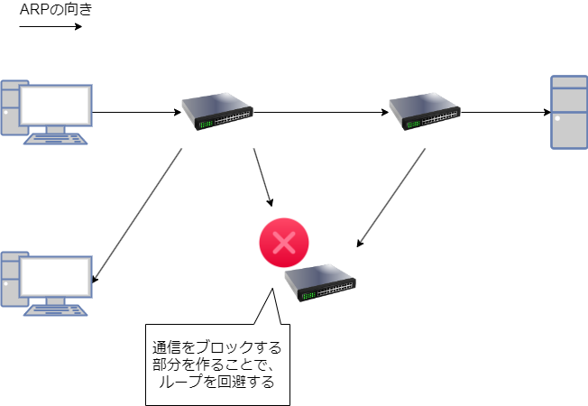

# STP ナレッジ部分
## 概要
- 実験日: 2022/08/22
- CCNA第8章相当 STP

## STP
## 1. STPの概要
スイッチを冗長化するとフレームが冗長部分をループし続けることがある。これをブロードキャストストームという。  
STPは、ブロードキャストストームを防ぐためのプロトコルである。IEEE802.1Dとして標準化されている。

## 2. STPの仕組み
STPは、冗長化構成における一部のポートの通信を行わない状態にする。
  
ブロックする部分を作り、スイッチの構造をツリー構造にすることでループを防ぐことができる。  
ツリー構造の起点となる中心のスイッチをルートブリッジと呼ぶ。STPでは、ルートブリッジから最も遠いポートをブロックする。  
ルートブリッジの決定は以下の手順で行われる。
- BPDU(スイッチ間で情報交換を行うための管理用フレーム)を送信し合う
- BPDUを受信したスイッチは、BDPUのブリッジIDを確認する。自身が認識しているルートブリッジのブリッジIDよりも小さい値だった場合、ルートブリッジIDを受信したものに変更する
- 再びBPDUを送信する際、BDPUのルートブリッジIDを新しく認識したルートブリッジIDにして送信する  

ルートブリッジが決定すると、続いてそれぞれのポートの役割を決定する。
- ルートポート(RP: Root Port)　ルートブリッジまでの最短のパスコストを持つポート
- 指定ポート(DP: Designated Port)　同じセグメント上のスイッチで最もルートブリッジに近いポート
- 非指定ポート(NDP: Non Designated Port)　上記以外のポート

ルートポートは以下の順で決定される。
- 累計のルートパスコストが最も小さいポート
- 送信元ブリッジIDが最も小さいBPDUを受け取ったポート
- 送信元ポートIDが最も小さいBPDUを受け取ったポート

指定ポートは以下の順で決定される。
- ルートパスコストが最も小さいBPDUを送信するポート
- 送信元ブリッジIDが最も小さいBPDUを送信するポート
- 送信元ポートIDが最も小さいBPDUを送信するポート

ルートポート、指定ポートにならなかったポートは非指定ポートとなる。

## 3. ポートの状態
RPやDPなどが決まっても、すぐに転送可能な状態になるわけではない。ポートは以下のステータスを遷移していく。
- Disabled：シャットダウンされていたり、障害が発生して無効となっていたりする状態
- Blocking：BPDUを受信するが、データフレームを転送しない状態
- Listening：BPDUを送受信し、各ポートの役割決定を行っている状態
- Learning：BPDUを送受信し、MACアドレステーブルを学習している状態
- Forwarding：データの転送が可能な状態

すべてのスイッチで安定した状態になることをコンバージェンスという。

## STP関連の機能
## 1. PortFast
STPはコンバージェンスまでに30~50秒ほどかかってしまう。  高速にコンバージェンスさせるためのCisco独自の機能としてPortFastがある。  
PortFastを設定することで、そのポートはすぐにForwarding状態となり通信が可能となる。PCなどが直接接続され、Forwardingになることがあらかじめ確定しているポートに設定する。

## 2. BPDUガード
PortFastが設定されたポートにBPDUが届いてしまうことは、想定していないスイッチがネットワークに接続された可能性があることを意味する。これにより、ルートブリッジが置き換わってしまう可能性がある。  
このようなトラブルを防ぐために、BPDUガードがある。BPDUを受け取るべきでないポートにBPDUガードを設定することで、BPDUを受け取らないようにすることができる。

## 3. ルートガード
ルートガードは、既存の環境よりもブリッジプライオリティが小さいスイッチが接続された際に、ルートブリッジが変わってしまうのを防ぐ仕組みである。  
ルートガードが設定されているポートにルートブリッジよりも上位のBPDUが送信されると、ルート不整合(root-Inconsistent)という状態に遷移する。この状態になったポートでは通信がブロックされる。

## 4. RSTP
コンバージェンスを速くしたSTPとしてIEEE 802.1wで標準化されているRSTPがある。RSTPはSTPと互換性があり、今日では広く普及している。  
RSTPは非指定ポートを代替ポートとバックアップポートの2つに分類する。代替ポートはルートポートの予備で、ルートポートに障害が起きた場合は代替ポートがルートポートになる。バックアップポートは指定ポートの予備で、指定ポートに障害が起きた場合はバックアップポートが指定ポートになる。  
RSTPでは3つのステータスを遷移する。
- Discarding：ユーザのデータを転送しない、MACアドレスを学習しない
- Learning：ユーザのデータを転送しない、MACアドレスを学習する
- Forwarding：ユーザのデータを転送する、MACアドレスを学習する

STPでは2秒ごとにBPDUを送信するタイマーによる管理を行っているが、RSTPではスイッチ間で直接やり取りして役割を決定する。ルートブリッジからBPDUを受け取ったときに下流のスイッチに送信するのではなく、それぞれのスイッチがBPDUを作成して下流のスイッチに送信する。また、構成の変更が検知された際も、そのスイッチが他のスイッチに変更を通知する。  
RSTPでは'プロポーザル'と'アグリーメント'をやり取りする。スイッチが自身のポートを指定ポートとし、プロポーザルというBPDUを送信する。受け取ったBPDUからどちらのスイッチが上位かを判断する。下位のスイッチはアグリーメントというBPDUを送信して、相手が指定ポートになることに同意する。  
このように、RSTPではスイッチ間で直接やり取りを行うことで高速にコンバージェンスすることができる。