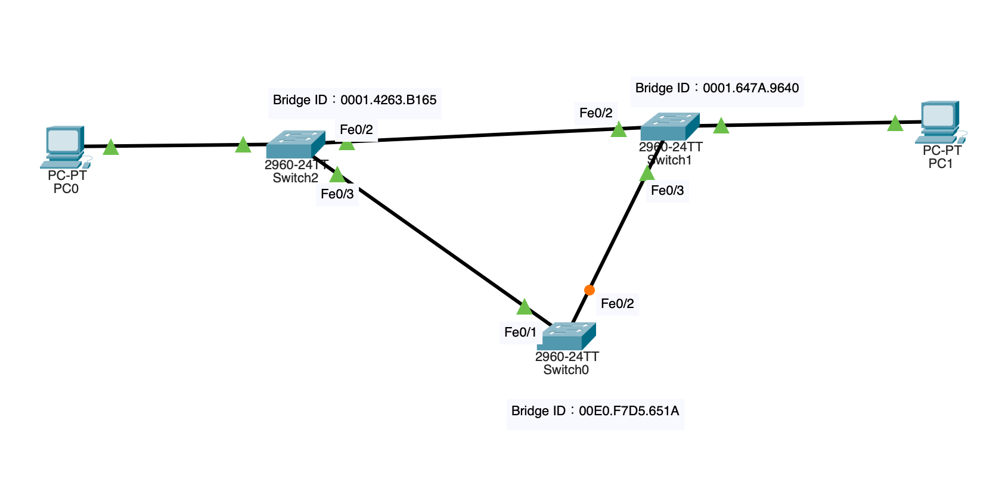
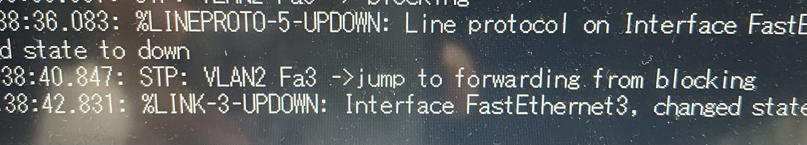

# STP(実験)
## 概要
- 実験日: 2022/08/22
- CCNA第8章相当
- 研究室での実験では、スイッチの数が足らなかったためルーターを代用した
- それによって実験できない部分が発生したため、当レポートはPacket Tracerを使用して自宅で再度実験を行ってまとめたものである
- STP関連の詳しい情報は「20220822-STPknowledge.md」で記述してあるため省略

## 1. 実験環境 

実験環境を以下に示す。 

図１　実験環境

* CCNA完全合格テキストのp712 図8.3.1を参考
* 各スイッチの接続されているインターフェースはVlan10に所属
* PC0のIPアドレス：192.168.100.1
* PC1のIPアドレス：192.168.100.2

## 2. 実験内容

### **実験１**
各スイッチでshow spaning-tree vlan 10で詳細確認
### **結果**
以下のような出力となった。

スイッチ０：  
>Switch#show spanning-tree vlan 10  
>VLAN0010  
>  Spanning tree enabled protocol ieee　・・・①  
>  Root ID    Priority    32778　・・・②  
>             Address     0001.4263.B165  
>             Cost        19  
>             Port        1(FastEthernet0/1)  
>             Hello Time  2 sec  Max Age 20 sec  Forward Delay 15 sec  
>  
>  Bridge ID  Priority    32778  (priority 32768 sys-id-ext 10)　・・・③  
>             Address     00E0.F7D5.651A  
>             Hello Time  2 sec  Max Age 20 sec  Forward Delay 15 sec  
>             Aging Time  20  
>  
>Interface　　　　　Role　Sts　Cost　　　　Prio.Nbr Type　・・・④  
>  
>Fa0/1　　　　　　　Root　FWD　19　　　　　128.1　　P2p  
>Fa0/2　　　　　　　Altn　BLK　　19　　　　　128.2　　P2p  

スイッチ１：  
>Switch#show spanning-tree vlan 10  
>VLAN0010  
>  Spanning tree enabled protocol ieee　・・・①  
>  Root ID    Priority    32778　・・・②  
>             Address     0001.4263.B165  
>             Cost        19  
>             Port        2(FastEthernet0/2)  
>             Hello Time  2 sec  Max Age 20 sec  Forward Delay 15 sec  
>  
>  Bridge ID  Priority    32778  (priority 32768 sys-id-ext 10)　・・・③  
>             Address     0001.647A.9640  
>             Hello Time  2 sec  Max Age 20 sec  Forward Delay 15 sec  
>             Aging Time  20  
>  
>Interface　　　　Role　Sts　Cost　　　　Prio.Nbr　Type　・・・④  
>  
>Fa0/1　　　　　　Desg　FWD　19　　　　　128.1　　P2p  
>Fa0/2　　　　　　Root　FWD　19　　　　　128.2　　P2p  
>Fa0/3　　　　　　Desg　FWD　19　　　　　128.3　　P2p  

スイッチ２：  
>Switch#show spanning-tree vlan 10  
>VLAN0010  
>  Spanning tree enabled protocol ieee　・・・①  
>  Root ID    Priority    32778 　・・・②  
>             Address     0001.4263.B165  
>             This bridge is the root  
>             Hello Time  2 sec  Max Age 20 sec  Forward Delay 15 sec  
>  
>  Bridge ID  Priority    32778  (priority 32768 sys-id-ext 10)　・・・③  
>             Address     0001.4263.B165  
>             Hello Time  2 sec  Max Age 20 sec  Forward Delay 15 sec  
>             Aging Time  20  
>  
>Interface　　　　　Role　Sts　Cost　　　　Prio.Nbr　　Type　・・・④  
>
>Fa0/1　　　　　　　Desg　FWD　19　　　　　128.1　　　P2p  
>Fa0/2　　　　　　　Desg　FWD　19　　　　　128.2　　　P2p  
>Fa0/3　　　　　　　Desg　FWD　19　　　　　128.3　　　P2p

出力結果から以下の項目を確認することができた。  
①　動作するSTPの種類  
②　ルートブリッジの情報  
③　スイッチ自身の情報  
④　各インターフェースの情報  

### **実験２**
各スイッチでshow spaning-tree interfaceでインターフェースごとに確認
### **結果**
以下のような出力となった。  

スイッチ０のFe0/2：  
>Switch#show spanning-tree interface fastEthernet 0/2  
>Vlan　　　　　　　　Role　Sts　Cost　　　　Prio.Nbr　Type  
>VLAN0010　　　　　Altn　BLK　19　　　　　128.2　　P2p  

スイッチ１のFe0/2：  
>Switch#show spanning-tree interface fastEthernet 0/2  
>Vlan　　　　　　　　Role　Sts　Cost　　　　Prio.Nbr　Type  
>VLAN0010　　　　　Root　FWD　19　　　　　128.2　　P2p  

スイッチ２のFe0/2：  
>Switch#show spanning-tree interface fastEthernet 0/2  
>Vlan　　　　　　　　Role　Sts　Cost　　　　Prio.Nbr　Type  
>VLAN0010　　　　　Desg　FWD　19　　　　　128.2　　P2p  

出力結果から各インターフェースの状態を確認することができた。  
また、図１の構成と矛盾がなく状態もフォワーディングで通信できる状態であった。

### **実験３**
PC0からPC1へPingを打って疎通確認
### **仮説**
実験１、２で通信できる状態であることは確認できているため、Pingは通る。
### **結果**
PC0からPC1へのPingが通った。

>C:\>ping 192.168.100.2  
>  
>Pinging 192.168.100.2 with 32 bytes of data:  
>  
>Reply from 192.168.100.2: bytes=32 time<1ms TTL=128  
>Reply from 192.168.100.2: bytes=32 time=1ms TTL=128  
>Reply from 192.168.100.2: bytes=32 time<1ms TTL=128  
>Reply from 192.168.100.2: bytes=32 time=2ms TTL=128  
>  
>Ping statistics for 192.168.100.2:  
>    Packets: Sent = 4, Received = 4, Lost = 0 (0% loss),  
>Approximate round trip times in milli-seconds:  
>    Minimum = 0ms, Maximum = 2ms, Average = 0ms  

### **実験4**　
スイッチ0と２の通信を切断して、スイッチ0のFe0/2の挙動の確認  

### **結果**
パケットトレーサーでは2960-24TTというスイッチでdebug spanning-tree eventsコマンドが使えなかったため、  
show spanning-tree fastEthernet 0/2コマンドでポートの変化を確認した。  

以下のような出力となり、切断されたタイミングで非指定ポートからルートポートに変化して動作することが確認できた。  
この際に、コンバージェンスできるまでに数十秒かかった。    

*切断前：*  
>VLAN0010　　　　　Altn　BLK　19　　　　128.2　　　P2p

*切断後*
>VLAN0010　　　　　Root　LSN　19　　　　128.2　　　P2p  
　　　　　　　　　　　　　　↓↓↓  
>VLAN0010　　　　　Root　LRN　19　　　　128.2　　　P2p  
　　　　　　　　　　　　　　↓↓↓  
>VLAN0010　　　　　Root　FWD　19　　　　128.2　　　P2p  

### **実験5**　
スイッチ１のブリッジプライオリティを4096で変更  
ルートブリッジが変わるかをshow spaning-tree vlan 10で確認  

### **結果** 
vlan10なのでブリッジプライオリティが4096+10の4106に変更されていた。  
>Root ID　　　Priority　　4106  

また、各スイッチでshow spanning-tree vlan 10を打つと、以下に示す通りルートブリッジがスイッチ１となり、各スイッチのポートも変化していた。    
スイッチ０：    
>Interface　　　　　Role　Sts　Cost　　　　Prio.Nbr Type　
>  
>Fa0/1　　　　　　　Altn　BLK　　19　　　　　128.1　　P2p  
>Fa0/2　　　　　　　Root　FWD　　19　　　　　128.2　　P2p  

スイッチ１：  
>  Root ID    Priority    4106 　 
>             Address     0001.647A.9640  
>             This bridge is the root  
>             Hello Time  2 sec  Max Age 20 sec  Forward Delay 15 sec

>Interface　　　　Role　Sts　Cost　　　　Prio.Nbr　Type　 
>  
>Fa0/1　　　　　　Desg　FWD　19　　　　　128.1　　P2p  
>Fa0/2　　　　　　Desg　FWD　19　　　　　128.2　　P2p  
>Fa0/3　　　　　　Desg　FWD　19　　　　　128.3　　P2p  

スイッチ２：  
>Interface　　　　Role　Sts　Cost　　　　Prio.Nbr　Type　 
>  
>Fa0/1　　　　　　Desg　FWD　19　　　　　128.1　　P2p  
>Fa0/2　　　　　　Root　FWD　19　　　　　128.2　　P2p  
>Fa0/3　　　　　　Desg　FWD　19　　　　　128.3　　P2p  

### **実験6**　
PC0につながっているスイッチ２のFe0/1をspanning-tree portfastコマンドでportfastの設定を行い、挙動の確認    
*※ エッジポートとなるポート以外に設定するとブロードキャストストームが起きるので注意！* 

### **結果**
通常であればリスニングからラーニングで15秒、ラーニングからフォワーディングで15秒かかるはずだが、図2（パケットトレーサーではdebugによる調査が行えなかったため、研究室で実験を行った際の画像を使用）のようにブロッキングからすぐにフォワーディングに遷移していることがわかる。  
  
図２　portfastの設定を行った際の画面  

### **実験7**　
spanning-tree mode rapid-pvstコマンドでRSTPを動作させ挙動の確認

### **結果**
各スイッチでshow spanning-tree vlan 10を打つと、Spanning tree enabled protocolがrstpに変化していることが確認できた。  
また、今回の実験環境ではSTPではただの非指定ポートだったポートがRSTPでは代替ポートとなっているため、スイッチ0とスイッチ1の間のケーブルを一度抜いて再び繋いでみると、接続した直後にフォワーディング状態となり数秒でコンバージェンスできた。  

## 3. まとめ

今回の実験を通して知り得たことを以下に箇条書きで示す。  
* STPを用いることでブロードキャストストームを防ぎ、スイッチの冗長化を行うことができる
* show spanning-tree vlan [番号]で、vlanごとにSTPの情報を確認することができる
* show spanning-tree interface [インターフェース名]で、インターフェースごとにSTPの情報を確認することができる
* ブリッジプライオリティを変更することでルートブリッジや各ポートの役割が、パスコストを変更することで各ポートの役割が変更される
* スイッチなどに接続されないポートにはportfastを設定することで、数秒でフォワーディング状態に遷移させれる
* 障害発生時には、BPDUを送りあうことでポートの役割を変更する
* その際に、STPでは転送遅延タイマーなどの兼ね合いでコンバージェンスまでに30秒ほどかかってしまう
* RSTPでは、非指定ポートが代替ポートもしくはバックアップポートとなり数秒でコンバージェンスできる

## 4. Packet Tracer
[STP.pkt](pkt/STP.pkt)
