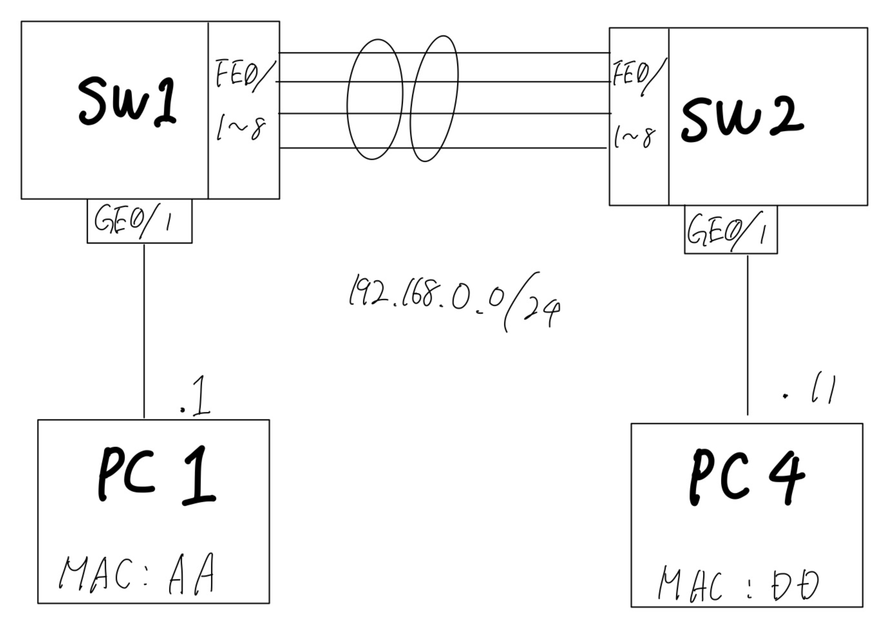
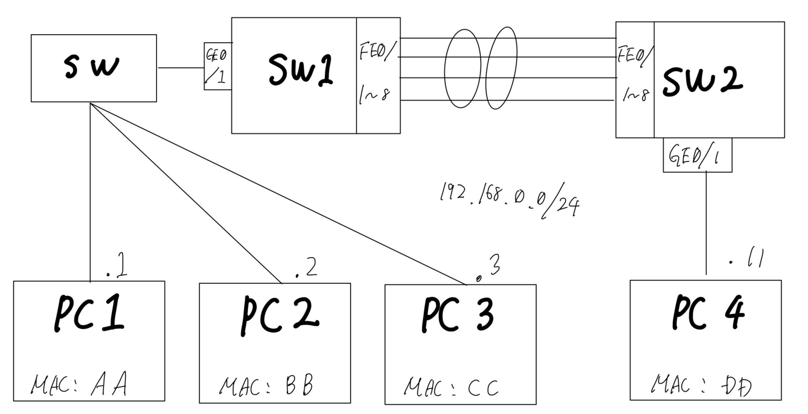

# EtherChannel
## 概要
- 実験日: 2022/08/23
- CCNA第9章相当 EtherChannel

## 1. EtherChannelの概要
EtherChannelはSTPのスイッチ間リンク冗長化に帯域幅増加を追加した機能と言える。  
LAG(Link Aggregation Group)とも呼ばれる。

### 1.1. スイッチ間リンクの冗長化
スイッチ間の物理リンクを最大8本束ねて1本の論理リンクとして扱い、耐障害性を高めることが出来る。  
束ねる事が出来る物理ポートは通信モード・リンク速度・VLAN設定など全ての設定が同一設定のポート群に制限される。  

### 1.2. 負荷の分散
STPは待機状態のリンクを利用することが出来ないが、EtherChannelは最大8本の物理リンクを束ねた論理リンクを提供する。  
EtherChannelの論理リンクは1本だが、実際のデータは物理リンクを通過する。  
データを分散することにより、理論上物理リンク全ての帯域を使う事が出来る。  
複数の物理リンクにデータを分散させるために、MACアドレス・IPアドレス・ポート番号などを元にデータの振り分けを行う。  
代表的な負荷分散オプションは以下の通りである。  

| オプション        | 負荷分散動作                |
|:-------------|:----------------------|
| src-mac      | 送信元MACアドレスを基に負荷分散     |
| dst-mac      | 宛先MACアドレスを基に負荷分散      |
| src-dst-mac  | 送信元及び宛先MACアドレスを基に負荷分散 |
| src-ip       | 送信元IPアドレスを基に負荷分散      |
| dst-ip       | 宛先IPアドレスを基に負荷分散       |
| src-dst-ip   | 送信元及び宛先IPアドレスを基に負荷分散  |
| src-port     | 送信元ポート番号を基に負荷分散       |
| dst-port     | 宛先ポート番号を基に負荷分散        |
| src-dst-port | 送信元及び宛先ポート番号を基に負荷分散   |

### 1.3. EtherChannelの種類とネゴシエーション
EtherChannelを構築するには、手動設定とネゴシエーションを利用した自動設定がある。  
自動設定は以下のプロトコルを使用できる
- PAgP(Port Aggregation Protocol)
- LACP(Link Aggregation Control Protocol)

PAgPはCisco独自のプロトコル、LACPはIEEE 802.3adとして標準化されたプロトコルである。  
どちらもほぼ同じ機能を提供する。混在することは出来ない。  

ネゴシエーションモードは2種類ある。  
自発的にネゴシエーションするモードとネゴシエーション要求を待機するモードがある。  
前者がLACPでactive、PAgPでdesirable。後者がLACPでpassive、PAgPでautoとなる。

## 2. 実験
### 2.1. 冗長性の確認

EtherChannelの冗長性を確認するために、以下の図に示す実験環境を用意した。  

#### 実験内容
- FE1-8をEtherChannelの対象ポートとする
- 自動LACPを使用し、両スイッチをactiveにする
- SW1-SW2間の物理リンクの本数は1～8本で任意
- PC1-PC4間でPINGを飛ばし続け、スイッチ間のリンクの接続を切替・切断する。

> SW1(config) #interface range fastEthernet 0/1 - fastEthernet 0/8  
> SW1(config-if-range) #channel-protocol lacp  
> SW1(config-if-range) #channel-group 1 mode active  
> Creating a port-channel interface Port-channel 1

> SW2(config) #interface range fastEthernet 0/1 - fastEthernet 0/8  
> SW2(config-if-range) #channel-protocol lacp  
> SW2(config-if-range) #channel-group 1 mode active  
> Creating a port-channel interface Port-channel 1  

FE1-3を接続した状態。  
FE1-8がバンドルされ、FE1-3がリンクアップしていることが確認できる。
> SW1#show etherchannel summary  
> Flags:  D - down        P - in port-channel  
> I - stand-alone s - suspended  
> H - Hot-standby (LACP only)  
> R - Layer3      S - Layer2  
> U - in use      f - failed to allocate aggregator  
> u - unsuitable for bundling  
> w - waiting to be aggregated  
> d - default port  
>  
>  
> Number of channel-groups in use: 1  
> Number of aggregators:           1  
>  
> Group  Port-channel  Protocol    Ports  
> ------+-------------+-----------+----------------------------------------------  
>  
> 1      Po1(SU)           LACP   Fa0/1(P) Fa0/2(P) Fa0/3(P) Fa0/4(D) Fa0/5(D) Fa0/6(D) Fa0/7(D) Fa0/8(D)  

#### 結果
全ての物理リンクを切断しない限り、切断の後再接続された。  
【PC1】  
> Reply from 192.168.0.11: bytes=32 time<1ms TTL=128  
> Reply from 192.168.0.11: bytes=32 time<1ms TTL=128  
> Request timed out.  
> Request timed out.  
> Reply from 192.168.0.11: bytes=32 time=7ms TTL=128  
> Reply from 192.168.0.11: bytes=32 time<1ms TTL=128  

### 2.2. 負荷分散の確認
初期設定で送信元MACアドレスを基にした負荷分散が実行されている。
> SW1#show etherchannel load-balance  
> EtherChannel Load-Balancing Operational State (src-mac):  
> Non-IP: Source MAC address  
> IPv4: Source MAC address  
> IPv6: Source MAC address  

片方のスイッチにPCを3台ぶら下げ、iperf3を用いて帯域測定を行う。  
以下の図に示す実験環境を用意した。

#### 実験内容
- 各PCにiperf3をインストールする
- PC1-3はPC4に対してiperfを走らせる
- PC4のNICを流れるデータ量を観測する

#### 結果
100Mの物理リンクが3本**以上**の場合
- PC1-3からPC4に向けて送信した場合、負荷分散が適用されて**各セッション**100Mbps弱(合計300Mbps)の速度が出たことを確認できた  
- 逆向きに通信した場合、3セッション**合計**で100Mbps弱の速度が出たことを確認できた  
↑送信元MACアドレスが同一なので負荷分散が働かなかったと考えられる。  

100Mの物理リンクが3本**以下**の場合
- PC1-3からPC4に向けて送信した場合、リンクの合計帯域に制限された
- バンドル本数が2本の場合は約50Mbpsが2セッション、約100Mbpsが1セッションになった

以下の図はバンドル本数を2→0本まで減らしたときのPC4の通信量である。

### 3. まとめ
- EtherChannelはスイッチ間のリンクを最大8本束ね冗長化し、負荷分散によって論理的なリンク速度を上げる事が出来る
- バンドルする物理ポートの設定は統一する必要がある
- EtherChannelの構築は手動設定以外にPAgPやLACPのネゴシエーションによって自動設定することもできる

出展  
シスコ技術者認定教科書 CCNA 完全合格テキスト&問題集[対応試験]200-301, 初版, ISBN:978-7981-6577-6