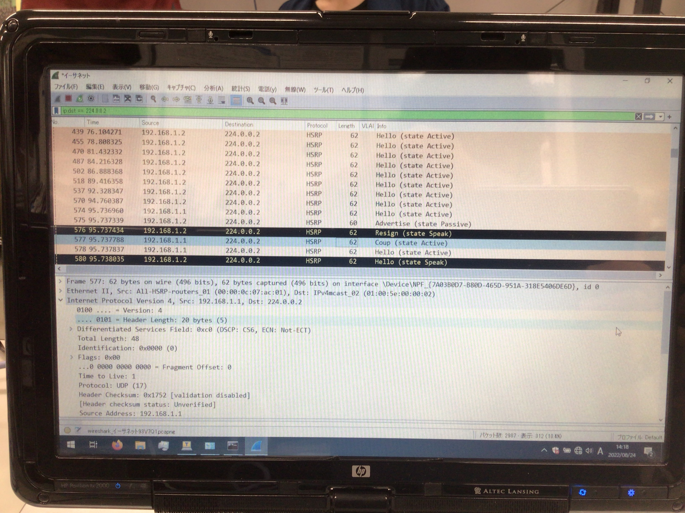

# HSRP

## 概要
- 実験日: 2022/07/24
- CCNA第 11章 その他のインフラストラクチャサービスと運用

## 目次
  - [概要](#概要)
  - [目次](#目次)
  - [1 実験環境と構築](#1-実験環境と構築)
  - [2 実験内容](#2-実験内容)
    - [2.1 実験1](#21-実験1)
    - [2.2 実験2](#22-実験2)
    - [2.3 実験3](#23-実験3)
    - [2.4 実験4](#24-実験4)
  - [3 まとめ](#3-まとめ)
  - [4 参考文献･引用](#4-参考文献･引用)

---
## 1 実験環境と構築


**図1:実際に構築の際に用いた図**

Ciscoパケットトレーサーで再現し以下に示す。


**図2,Ciscoのパケットトレーサーで再現したHSRPの設計画像**

> 簡易的な構築手順を以下に示す｡ <br>
>   ① すべての端末にIPアドレスを割り当てる｡ <br>
>   ② RT1及びRT2には､スタンバイグループを1にする｡ <br>
>   ③ RT1､RT2には､プライオリティ値110､100を割り当てる｡(RT1:アクティブルータ､RT2:スタンバイルータ) <br>
>   ④ RT1､RT2にプリエンプトコマンドを打ち込む｡  <br>

---

## 2 実験内容
### 2.1 実験1
  ルータのHSRPに関する情報を確認する｡<br>
  show standby briefコマンドを入力することによって､グループ番号が同じ値であるか｡<br>
  プライオリティの高い値がアクティブになっているか｡<br>
  仮想IPアドレスが正しく入力されているかなどを確認する｡

  - 結果<br>
    RT1
    ```
    RT1#show standby brief 
                     P indicates configured to preempt.
                     |
    Interface   Grp  Pri P State    Active          Standby         Virtual IP
    Gig0/0/1    1    110 P Active   local           192.168.1.2     192.168.1.254 
    ```
    <br>RT2
    ```
    RT2#show standby brief 
                     P indicates configured to preempt.
                     |
    Interface   Grp  Pri P State    Active          Standby         Virtual IP
    Gig0/0/1    1    100 P Standby  192.168.1.1     local           192.168.1.254 
    ```
    
    RT1と2は同じグループ番号であることがわかる｡<br>
    プライオリティ値が高いRT1のほうがアクティブルータになっていることがわかり､RT2はスタンドバイルータであることがわかる｡<br>
    仮想IPアドレスは､RT1､RT2の両方とも正しく入力されていることがわかった｡

### 2.2 実験2
  PC1は､RT1のIPアドレスとHSRPで作成した仮想IPアドレスに対してPINGを打ち続ける｡<br>
  PINGを打ち続ける途中で､プライオリティ値が高いRT1に対して繋がっているLANケーブルを引き抜く｡<br>
  引き抜いた後に､PINGによる通信が回復することやRT2がアクティブルータになっているかを確認する｡
  - 結果<br>
    ```
    RT1#show standby brief 
                     P indicates configured to preempt.
                     |
    Interface   Grp  Pri P State    Active          Standby         Virtual IP
    Gig0/0/1    1    110 P Init     unknown         unknown         192.168.1.254
    ```
    ```
    RT2#show standby brief 
                     P indicates configured to preempt.
                     |
    Interface   Grp  Pri P State    Active          Standby         Virtual IP
    ig0/0/1    1    100 P Active   local           unknown         192.168.1.254
    ```

    RT1からLANケーブルを引き抜くと初期状態となりステータスもunknownになっていることがRT1とRT2を見ると確認することができる｡

    コマンドプロンプト  
    ping 192.168.1.1 -t
    ```
    (省略)
    192.168.1.1 からの応答: バイト数=32 時間 < 1ms TTL=255
    192.168.1.1 からの応答: バイト数=32 時間 < 1ms TTL=255
    要求がタイムアウトしました｡
    要求がタイムアウトしました｡
    192.168.1.10 からの応答: 宛先ホストに到達できません｡
    192.168.1.10 からの応答: 宛先ホストに到達できません｡
    (省略)
    ```
    ping 192.168.1.254 -t
    ```
    (省略)
    192.168.1.254 からの応答: バイト数=32 時間 < 1ms TTL=255
    192.168.1.254 からの応答: バイト数=32 時間 < 1ms TTL=255
    要求がタイムアウトしました｡
    要求がタイムアウトしました｡
    192.168.1.254 からの応答: バイト数=32 時間 < 1ms TTL=255
    192.168.1.254 からの応答: バイト数=32 時間 = 2ms TTL=255
    (省略)
    ```
    LANケーブルを引き抜くと､192.168.1.1に対するPINGは､一切通らなくなった｡一方で､192.168.1.254に対するPINGは､通らなくなった10秒後に､RT2がアクティブルータになったため､PINGが通るようになった｡


### 2.3 実験3
  実験2から引き抜いたLANケーブルを再び接続し直し､プライオリティ値が高いRT1が接続した瞬間に､show standby briefコマンドを入力することで､HSRPの状態がListenに切り替わっているか確認する｡<br>
  また､アクティブルータがRT1になりスタンドバイルータがRT2になっているか確認する｡
  - 結果<br>
    ```
    RT1#show standby brief 
                     P indicates configured to preempt.
                     |
    Interface   Grp  Pri P State    Active          Standby         Virtual IP
    Gig0/0/1    1    110 P Listen   unknown         unknown         192.168.1.254  
    ```

    ```
    RT2#show standby brief 
                     P indicates configured to preempt.
                     |
    Interface   Grp  Pri P State    Active          Standby         Virtual IP
    Gig0/0/1    1    100 P Listen   unknown         unknown         192.168.1.254 
    ```

    RT1にLANケーブルを接続し直すことで､お互いのルータは､Listen状態となり､お互いにHelloパケットによる生存確認していることがわかる｡<br>

    コマンドプロンプト<br>
    ping 192.168.1.1 -t
    ```
    (省略)
    192.168.1.10 からの応答: 宛先ホストに到達できません｡
    192.168.1.10 からの応答: 宛先ホストに到達できません｡
    192.168.1.1 からの応答: バイト数=32 時間 < 991ms TTL=255
    192.168.1.1 からの応答: バイト数=32 時間 < 1ms TTL=255
    (省略)
    ```
    ping 192.168.1.254 -t
    ```
    (省略)
    192.168.1.254 からの応答: バイト数=32 時間 < 1ms TTL=255
    要求がタイムアウトしました｡
    192.168.1.254 からの応答: バイト数=32 時間 < 1ms TTL=255
    (省略)
    ```
    実験2では､到達しなかった192.168.1.1がLANケーブルを繋ぎ直すことによって､PINGが通っていることがわかる｡また､アクティブルータが変わることによって､接続の切り替えが生じ一定時間の間に通信が途切れていることがわかる｡<br><br>

    ```
    RT1#show standby brief 
                     P indicates configured to preempt.
                     |
    Interface   Grp  Pri P State    Active          Standby         Virtual IP
    Gig0/0/1    1    110 P Active   local           192.168.1.2     192.168.1.254 
    ```

    ```
    RT2#show standby brief 
                     P indicates configured to preempt.
                     |
    Interface   Grp  Pri P State    Active          Standby         Virtual IP
    Gig0/0/1    1    100 P Standby  192.168.1.1     local           192.168.1.254 
    ```    

    LANケーブルを接続し直して､preemptコマンドを入力されていると､プライオリティ値が高いほうがアクティブルータに変わる｡一方で､preemptコマンドが入力されていない状態だと､接続し直してもRT1はアクティブルータにならない｡

### 2.4 実験4

  プリエンプトの設定を一度削除して､アクティブルータを断線させる｡<br>
  その際に､show standbyコマンドを入力し､プリエンプトがenableでないことを確認する｡<br>
  また､実験3より､プリエンプトの設定がない状態なら､プライオリティの低いルータがアクティブルータであり続けるのか否かを確認する｡

  - 結果
    ```
    RT1#show standby 
    GigabitEthernet0/0/1 - Group 1
      State is Active
        16 state changes, last state change 00:58:04
      Virtual IP address is 192.168.1.254
      Active virtual MAC address is 0000.0C07.AC01
        Local virtual MAC address is 0000.0C07.AC01 (v1 default)
      Hello time 3 sec, hold time 10 sec
        Next hello sent in 2.638 secs
      Preemption disabled
      Active router is local
      Standby router is 192.168.1.2, priority 100 (expires in 6 sec)
      Priority 110 (configured 110)
      Group name is hsrp-Gig0/0/1-1 (default)
    ``` 

    ```
    RT2#show standby 
    GigabitEthernet0/0/1 - Group 1
      State is Standby
        32 state changes, last state change 01:53:37
      Virtual IP address is 192.168.1.254
      Active virtual MAC address is 0000.0C07.AC01
        Local virtual MAC address is 0000.0C07.AC01 (v1 default)
      Hello time 3 sec, hold time 10 sec
        Next hello sent in 0.666 secs
      Preemption disabled
      Active router is 192.168.1.1, priority 110 (expires in 7 sec)
        MAC address is 0000.0C07.AC01
      Standby router is local
      Priority 100 (default 100)
      Group name is hsrp-Gig0/0/1-1 (default)
    ```
    Preemption disabledであることからプリエンプトが有効になっていないことがわかる｡

    ```
    RT1#show standby brief 
                     P indicates configured to preempt.
                     |
    Interface   Grp  Pri P State    Active          Standby         Virtual IP
    Gig0/0/1    1    110   Active   local           192.168.1.2     192.168.1.254
    ```

    ```
    RT2#show standby brief 
                     P indicates configured to preempt.
                     |
    Interface   Grp  Pri P State    Active          Standby         Virtual IP
    Gig0/0/1    1    100   Standby  192.168.1.1     local           192.168.1.254 
    ```
    実験の際には､preemptコマンドを入力してもしなくともプライオリティ値が高い方がアクティブルータとなったため､Wiresharkにてパケット情報を確認した｡
    
    **図3,Wiresharkのパケット情報**

    パケット情報を見ると､Coupパケットが含まれていることがわかる｡Ciscoによると､Coupは｢プライオリティが高いルータがプライオリティが低いルータをプリエンプション処理すると、coupメッセージが送信されます。プライオリティの低いアクティブルータは、プライオリティの高いアクティブルータからcoupメッセージまたはhelloメッセージを受信すると、スピーク状態に変わり、resign メッセージを送信します。｣と記載されている｡(1)
    <br>
    図3を見ると､アクティブルータとスタンバイルータを選出していることがわかることから､Ciscoルータのバグなのではないかと考える｡
---
## 3 まとめ
- HSRPの目的:ネットワークの冗長化
- HSRPの利点:何らかの原因によってルータが停止した際に､デフォルトゲートウェイの設定を変更する必要がなくなる点｡

- HSRPスタンバイグループを作成することによって､1つのルータとしてみなすことができる｡
- 仮想IPアドレスとは､ルータの持っている本来のIPアドレスではなく､HSRPのアクティブルータで利用するIPアドレス
- 仮想MACアドレスとは､ルータの持っている本来のMACアドレスではなく､HSRPのアクティブルータで利用するMACアドレス
  - MACアドレスの6オクテット目には､HSRPスタンバイグループで作成したスタンバイグループの番号を16進数する｡ 
- アクティブルータ:基本的にルーティングするルータのこと
  - アクティブルータの決定方法:<br>
    HSRPプライオリティを設定する際に､プライオリティ値が最も大きいものが選出される｡<br>
    また､プライオリティ値が同じ場合は､ルータに設定したIPアドレスが最も大きいものが選出される｡
- スタンバイルータ:何らかの原因で､アクティブルータからのHelloパケットを10秒以上受け取らない場合に自身がアクティブルータとなり引き継ぐルータのこと
- プリエンプト:プライオリティ値が大きいもしくは､同じプライオリティ値が同じであるときIPアドレスが大きいルータが常にアクティブルータになる機能のこと
- インターフェイストラッキング:ルータがupやdownをした際に､プライオリティ値を変更する機能のこと

---
## 4 参考文献･引用
1 [Cisco､｢ホットスタンバイルータプロトコル(HSRP)の機能について｣､2022/08/05､2022/09/05アクセス](https://www.cisco.com/c/ja_jp/support/docs/ip/hot-standby-router-protocol-hsrp/9234-hsrpguidetoc.html)