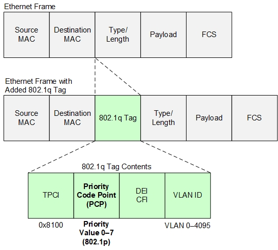

# QoS､SNMP

## 概要
- 実験日: 2022/07/24
- CCNA第 11章 その他のインフラストラクチャサービスと運用

## 目次
  - [概要](#概要)
  - [目次](#目次)
  - [1 QoSのまとめ](#1-qosのまとめ)
    - [1.1 QoSの背景](#11-qosの背景)
    - [1.2 QoSの目的](#12-qosの目的)
    - [1.3 QoSの種類](#13-qosの種類)
    - [1.4 DiffServの分類](#14-diffservの分類)
    - [1.5 信頼境界](#15-信頼境界)
    - [1.6 ポリシングとシェーピング](#16-ポリシングとシェーピング)
    - [1.7 キューイングとスケジューリング](#17-キューイングとスケジューリング)
    - [1.8 キューイングする方式の種類](#18-キューイングする方式の種類)
    - [1.9 輻輳の管理](#19-輻輳の管理)
  - [2 SNMPのまとめ](#2-snmpのまとめ)
    - [2.1 SNMP実験](#21-snmp実験)
    - [2.2 SNMPの背景](#22-snmpの背景)
    - [2.3 SNMPの目的](#23-snmpの目的)
    - [2.4 SNMPで主に取得できる情報](#24-snmpで主に取得できる情報)
    - [2.5 SNMP構成](#25-snmp構成)
    - [2.6 MIB](#26-mib)
    - [2.7 SNMPの通信種類](#27-snmpの通信種類)
    - [2.8 SNMPのバージョン](#28-snmpのバージョン)
  - [3 参考文献･引用](#3-参考文献･引用)


---
## 1 QoSのまとめ

### 1.1 QoSの背景
- 電話や動画などのリアルタイム性を重視するものと､画像や文章などの非リアルタイム性のものが等しく通信されると､電話に遅延が生じ品質が悪くなる
<br><br>
 
### 1.2 QoSの目的
- QoSとは､パケットに優先番号を付加することで遅延などのサービス品質を優先的に転送するプロトコル
<br><br>
 

### 1.3 QoSの種類
  - ベストエフォート
    - 最大限の通信速度をするために､パケットの優先順位を決めずに送信する方法 
  - IntServ
    - IntServとは､帯域を確保することで品質を保つことができる技術の1つ
    - IntServのデメリット:各ルータが帯域を確保するという情報を保持し続けなければならない
  - DiffServ
    - DiffServとは､パケットに設定している優先度に従い優先的に転送する技術の1つ
    - DiffServのデメリット:IntServと比較して､帯域を確保しないため通信速度を保証することができない
 
<br><br>

### 1.4 DiffServの分類
  - CoS
    - L2レベルでの優先度を表すもの
    - 図1よりPCP(CoS)タイプを利用して､3bitの中に優先度を示す情報が入る
    - 3bitの中に入る情報は､0~7の値を表示でき8種類の優先度を格納することが可能
      
      図1､EthernetFlameの情報
  - DSCP
    - L3レベルでの優先度を表すもの
    - IPヘッダ内のサービスタイプを利用する
    - TOS内の8ビット中の6ビットを使用して､前半3ビットは優先度を後半3ビットは破棄レベルを表す｡
    - DSCPパケット内容の特徴
      - 前半3ビットの値が大きければ優先度が高い
      - 後半3ビットの値が大きければ破棄されやすい
<br><br>

### 1.5 信頼境界
  - 信頼する区間と信頼しない区間を区別する
   
  - 信頼境界はなぜ必要なのか
    - 動画再生が遅い場合に､パケットキャプチャなどで､パケットのヘッダーを偽造されることで､CoSの値が変更されるため優先度が変化する｡優先度が変化しているパケットによって､ルータやスイッチに対して必要でないパケットに対しても処理を優先的に行う必要があり負荷がかかるため必要だ｡
<br><br>

### 1.6 ポリシングとシェーピング
  - ポリシング
    - 最低限保証している伝送速度を超過すると､トラフィックを破棄することや優先度を変更し送信する
    - 問題点
      - パケットを破棄するとTCP通信において､多くの再送制御が必要となりトラフィックが増大する可能性がある
  - シェーピング
    - 伝送速度の設定値を超過すると､ルータやスイッチ内のバッファに保持し､その後遅れて送信する
    - バッファ用のメモリが必要
    - 問題点
      - 遅れて送信する事により遅延が発生しやすい
<br><br>

### 1.7 キューイングとスケジューリング
  - キュー
    - データ構造の1つ
    - FIFO方式
 
  - キューイング
    - 送信するパケットをキューに並べる
    - ハードウェアキュー
      - 各NIC用のバッファメモリ
    - ソフトウェアキュー
      - 優先度によって複数のキューが存在する
      - Ethernetヘッダー内のCoSやIPヘッダー内のToSから優先度によって分類されて並べられる
  - スケジューリング
    - ソフトウェアキューに並んだパケットをどのような順番で並べるのかを示す
<br><br>

### 1.8 キューイングする方式の種類
  - PQ
    - 優先度が異なるパケットを4つに分けてキューを並べる
    - 優先度は､｢High｣､｢Medium｣､｢Normal｣､｢Low｣の4つのキューに分ける
    - 優先度の高いものから送信されるため､低い優先度は､高いものが送信し終えるまで送信されることはない
  - WFQ
    - 優先度のキューごとに重みを付けて送信するパケットの比率を変化するプロトコル
    - 自動的にキューを動的に制御する
    - 優先度は､TOS内の前半3ビットをもとに送信する
  - CB-WFQ
    - 管理者が定義したキューを割り当て､最低帯域幅の指定によって送信するパケットの比率を変化するプロトコル
  - LLQ
    - PQ + CB-WFQの組み合わせ
    - 最低帯域幅を保証しながら優先的なパケットを送信する
<br><br>

### 1.9 輻輳の管理
  - RED
    - キューがいっぱいになる前に､パケットをランダムに破棄するプロトコル
  - WRED
    - キューがいっぱいになる前に､パケットの優先順位を考慮して破棄するプロトコル
<br><br>

---
## 2 SNMPのまとめ
### 2.1 SNMP実験
  >簡易的な構築手順を以下に示す。<br>
  >① SNMPビューを作成し標準MIBのsystemと拡張MIBのciscoのそれぞれを取得する｡<br>
  >② SNMPグループを作成する｡<br>
  >③ SNMPユーザ及びセキュリティレベルやパスワードを設定する<br>

  使用したコマンドを以下に示す｡
  >①snmp-server view testview system include <br>
  >①snmp-server view testview cisco include <br>
  >②snmp-server group testgroup v3 priv read testview <br>
  >③snmp-server user user01 testgroup v3 auth sha password priv aes 256 password <br>

- 実験1<br>
    SNMPグループの確認
    ```
    show snmp group
    ```
  - 結果<br>
    ```
    groupname: testgroup  security model:v3 priv
    contextname:<no context specified>  storage-type: nonvolatile
    readview : testview   writeview: <no writeview specified>
    notifyview: <no notifyview specified>
    row status: active
    ```
    作成したグループ名(testgroup) <br>
    セキュリティモデル(SNMPv3 priv) <br>
    読み取りを許可するビュー(testview)を確認することができる

- 実験2<br>
    SNMPユーザの確認
    ```
    show snmp user
    ```
  - 結果<br>
    ```
    User name: user01
    Engine ID:8000000903002C542D236D0C
    storage-type nonvolatile   active
    Authentication Protocol: SHA 
    Privacy Protocol: AES256
    Group-name: testgroup
    ```
    ユーザー名(user01) <br>
    認証プロトコル(SHA) <br>
    プライバシープロトコル(AES256) <br>
    グループ名(testgroup)を確認することができる

<br><br>

### 2.2 SNMPの背景
  - 複数のルータやスイッチを管理する際に､何らかの原因で故障によったものを､1つ1つ確認して見て回るのは手間がかかる｡
<br><br>

### 2.3 SNMPの目的
  - ネットワーク上に接続されている機器の情報をサーバーで収集管理し､見ることができれば1つ1つ確認する必要がなくなる｡
<br><br>

### 2.4 SNMPで主に取得できる情報
  - CPU
  - メモリ
  - ディスク
  - トラフィック量
<br><br>

### 2.5 SNMP構成
  - SNMPマネージャ
    - 管理側のサーバー
    - SNMPエージェントに対してオブジェクト識別子を指定して情報を受信する
  - SNMPエージェント
    - 管理される側のルータやスイッチ､PCなど
    - SNMPマネージャに対して指定されたOID
    - 機器の情報を送信する
    - UDPにて送信(Port 161,162)
<br><br>

### 2.6 MIB
  - 集めた情報をツリー構造のデータベースに保存する
  - 標準MIB
    - IETFが発行したRFCで規定されているMIB
  - 拡張MIB
    - ベンダーが独自に規定したMIB
<br><br>

### 2.7 SNMPの通信種類
  - SNMPポーリング
    - 定期的にサーバー(マネージャ側)から要求を出し情報を受信する
  - SNMPポーリングの問題点
    - 定期的に確認するとログの量が増えて､インシデントが起きた際に問題を見つけるのが遅れる

  - SNMPトラップ
    - SNMPポーリングの機能 + ルータ(エージェント側)からサーバー(マネージャ)に対して通知を送信する
    - リンクのアップダウンやHSRPで決めたサーバーに変化があった際に通知を送信する設定も可能
    - 一度のみの送信であるため再送不可
  - SNMPトラップの問題点
    - ネットワークの輻輳などでサーバー(マネージャ側)への通信が届かない可能性がある｡ 

  - SNMPインフォーム
    - SNMPトラップの機能 + サーバー(マネージャ側)からの応答を受信する
    - UDPであるためTCPのような再送制御はしない｡一方で､サーバー(マネージャ側)からの応答がない場合に再度SNMPインフォームを送信する｡
<br><br>


### 2.8 SNMPのバージョン
  - SNMPv1
    - コミニティ名を利用して認証
    - 平文通信で盗聴の危険性
    - SNMPトラップまでしか対応していないため､SNMPインフォームのように再送することはできない
  - SNMPv2c
    - コミニティ名を利用して認証
    - 平文通信で盗聴の危険性
    - SNMPインフォームに対応  
  - SNMPv3
    - USMを利用した認証(ユーザー名 MD5 SHA)
    - 通信データの暗号化(DeS,AES 128,256)が可能となり盗聴の危険性が他のバージョンと比較して安全性が高い
    - SNMPインフォームに対応
<br><br>

---
## 3 参考文献･引用
[WatchGuard Help Center､｢VLAN インターフェイスの 802.1p マーキングについて｣､2022/09/09アクセス](https://www.watchguard.com/help/docs/help-center/ja-JP/Content/en-US/Fireware/networksetup/images/diagram_vlan_layer2_marking.jpg)