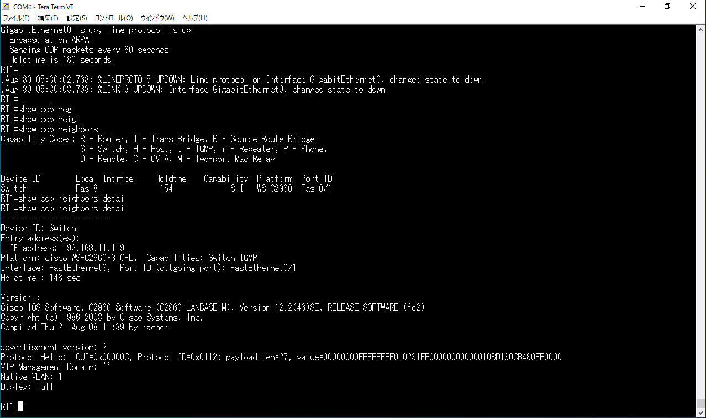

# デバイス管理
## 概要
- 実験日: 2022/08/30
- CCNA第12章相当 デバイスの管理

## 1. システムログの管理
ルータやスイッチではさまざまなシステムログが出力される。  
システムログは重大度別に区分けされている。
| 重大度 | 意味 | 説明 |
| ---- | ---- | ---- |
| 0 | 緊急 | システムが不安定 |
| 1 | 警報 | ただちに対応が必要 |
| 2 | 重大 | クリティカルな状態 |
| 3 | エラー | エラー状態 |
| 4 | 警告 | 警告状態 |
| 5 | 通知 | 正常だが注意を要する状態 |
| 6 | 情報 | 単なる情報メッセージ |
| 7 | デバッグ | デバッグメッセージ |

### Syslog
SyslogはCisco製のルータやスイッチが対応しているプロトコルである。ネットワーク機器のログは個々に出力されるが、多数の機器がある場合は確認に手間がかかる。Syslogを用いることで1ヶ所でログを監視することができる。

### 実験

サブネットマスク：/24  
Syslogサーバ：192.168.100.200  
RT：192.168.100.1  
PC：192.168.100.101  
NTPサーバ：192.168.100.102  
  
ログレベルの変更コマンド  
`(config)#logging console <レベル>`
  
ログレベルを5に設定した際にLANケーブルの抜き差しを行ったが、ログは出力されなかった。  
ログレベルを6に設定すると、リンクアップのログが出力されていることがわかる。  

RTのログ出力先をSyslogサーバに変更する。  
ログ出力先変更コマンド  
`(config)#logging host <IPアドレス/ホスト名>`  
上記の設定をするとルータ上からはログを確認することができなくなる。  

ログの情報を参照するコマンド  
`#show logging`  
  
ログの出力先が192.168.100.200に変更されていることがわかる。

## 2. NTP
NTPはネットワーク機器間の時刻のずれをなくすために、標準時を把握している時刻サーバと同期をとるためのプロトコルである。  
  
NTPサーバの設定コマンド  
`(config)#ntp server <IPアドレス> [prefer]`  
タイムゾーンの設定コマンド  
`(config)#clock timezone <タイムゾーンの略称> <時差>`  
NTP設定の確認コマンド  
`#show ntp status`  
NTPの時刻同期の確認コマンド
`#show ntp associations`  
  
上記のコマンドを実行し、192.168.100.102をNTPサーバとして実験を行ったが、NTPサーバが動作せず実験は失敗してしまった。

## 3. CDP・LLDP
### CDP
CDP(Cisco Discovery Protocol)はCisco独自のプロトコルで、隣接する機器の情報を取得するプロトコルである。
  
CDPを有効にするコマンド  
`(config)#cdp run`  
CDPの状態の確認コマンド  
`#show cdp`  
インタフェース情報の確認コマンド  
`#show cdp interface`  
隣接機器の要約情報確認コマンド  
`show cdp neighbors`  
隣接機器の詳細情報確認コマンド  
`show cdp neighbors detail`  
  
RT1に隣接する機器の情報が確認できた。  
  
## LLDP
LLDPはIEEE 802.1ABで標準化された隣接機器の情報を確認するためのプロトコルである。標準化されているため、Cisco製品以外でも利用することができる。

## 3. その他の管理機能
### バナーメッセージの設定
ユーザが機器にコンソール接続した際に、メッセージを出力することができる。  
バナーメッセージ設定コマンド  
`(config)#banner motd <区切り文字>`
